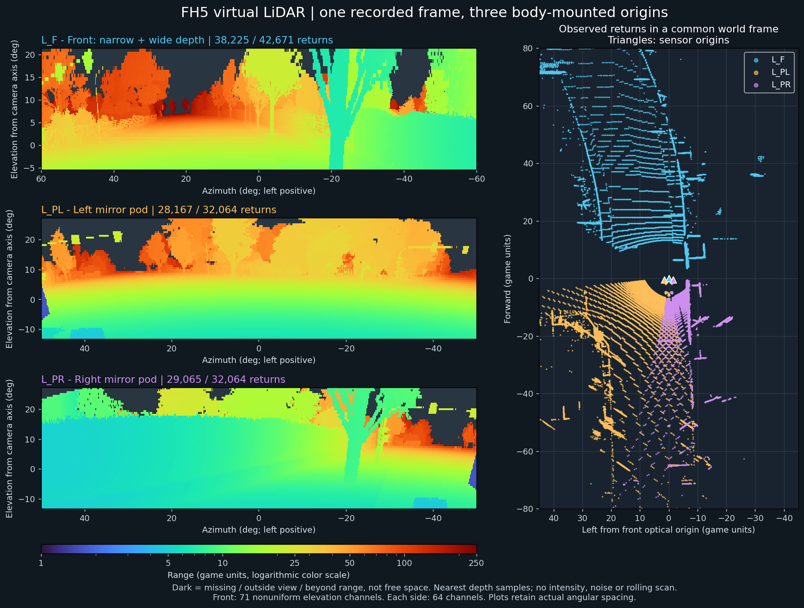

# 깊이 기반 가상 라이다

현재 ROS 브리지는 같은 프레임의 미터 depth에서 GPU로 빔을 샘플링해 세 PointCloud2를 발행합니다. 설정은 [phase1-lidar-private.json](../ot/presets/phase1-lidar-private.json)입니다.

| 센서 | 자세·깊이 소스 | 수평 | 수직 | 최대 거리 |
| --- | --- | --- | --- | --- |
| L_F | mirror4 기준, mirror3 협각 우선 / mirror4 광각 | -60…60°, 0.2° | -5…21°, 71채널 | 250m |
| L_PL | mirror6 | -50…50°, 0.2° | -13…27°, 64채널 | 150m |
| L_PR | mirror7 | -50…50°, 0.2° | -13…27°, 64채널 | 150m |

각도는 센서 광축 기준이며 방위각 좌측·고각 위쪽이 양수입니다. 센서 XYZ는 전방·좌측·위쪽입니다. 포드를 이동하면 해당 라이다의 원점과 TF도 따라갑니다.

## 생성과 결측

1. 빔을 실제 projection·viewport로 소스 픽셀에 투영합니다.
2. 소스 순서에서 시야에 들어오는 첫 카메라를 선택합니다. 소스들은 같은 광학 원점을 사용합니다.
3. nearest 픽셀의 DSV 깊이를 읽고 `range = optical_depth / -beam_eye_z`로 변환합니다.
4. Windows 릴레이가 빔 방향×range로 XYZ를 만들고 ROS 메시지에 직접 씁니다.

라이다만 구독하면 전체 depth 영상의 CPU readback을 생략합니다. 물체 경계는 픽셀 단위 근사이며 `source_ray_error_deg`로 빔과 소스 픽셀 중심의 각도 차이를 제공합니다.

| 필드 | 의미 |
| --- | --- |
| x/y/z, range | 센서 좌표·거리(m), FLOAT32 |
| beam_index | 빔 index |
| status | 0 반환, 1 소스 시야 밖, 2 유효 깊이 없음, 3 거리 초과 |
| source_camera | 원본 렌더 슬롯 |
| source_pixel_x/y | 선택한 원본 픽셀 |
| source_ray_error_deg | 빔과 픽셀 중심 광선의 차이 |

결측 빔의 XYZ·range는 NaN입니다. 렌더 visibility·LOD·가림이 관측 범위를 결정합니다. 현재 센서는 노이즈 없는 순간 깊이 관측이며 intensity·다중 반사·회전 스캔 시간차·재질별 미검출은 후속 기능입니다.

## Foxglove 색상

3D 패널의 각 `/ets2/lidar/*/points`에서 `Color mode=Color map`, `Color field=range`, `Color map=Turbo`를 선택합니다. 근처 형태는 min/max 0/30 또는 0/50m로 확인합니다. `<distance>`와 같은 범위로 비교하면 XYZ 기반 거리와 range 필드 색상을 대조할 수 있습니다. [Foxglove 설정](https://docs.foxglove.dev/docs/visualization/panels/3d#point-cloud).

0.23.0의 실제 ROS 수신 range는 전방 5.08–120.99m, 좌측 0.93–149.95m, 우측 0.94–144.69m였습니다. 거리 값은 변화합니다. 화면이 단색이면 해당 토픽의 색상 필드와 min/max를 확인합니다.

## 정합과 오프라인 도구

같은 DSV의 GPU 빔 106,799개를 Python 복원과 대조했습니다. 같은 픽셀 선택 시 최대 range 차이는 전방 0.0000763m, 측면 0.0000305m였습니다. FP32/FP64 투영의 경계 픽셀 선택 차이로 양쪽 유효 빔의 최대 차이는 0.046m였습니다.

```powershell
.\ot\ot.cmd lidar '<frame.tar.zst>' --config .\ot\presets\phase1-lidar-private.json --output lidar.npz
```

`otpy.bundles.load_bundle`, `otpy.lidar.read_lidar`로 기존 디렉터리·ZIP·TAR.ZST를 읽습니다. 이전 슬롯 0·1·2·5 자료에는 `phase1-lidar.json`을 사용합니다.


