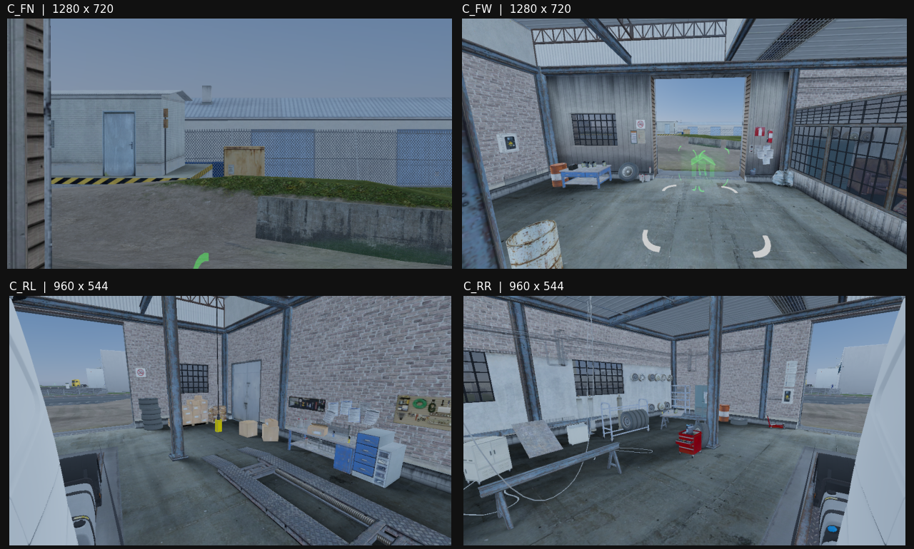
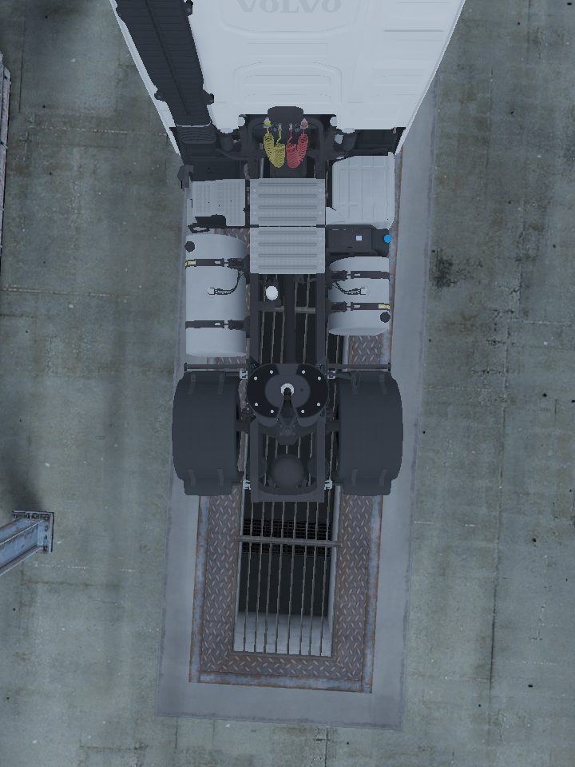

# ROS 2 bridge

Implementation follows the approved Windows C++ relay → WSL Ubuntu/Jazzy design.
Sensor and state traffic use separate TCP connections to the WSL eth0 IPv4 address.
The relay produces little-endian XCDRv1 with Fast-CDR; Linux publishes the serialized
messages using installed ROS type support. The game DLL stays independent of ROS.

## Foreground baseline — 2026-10-09, core 0.17.0

All three conditions used the same stationary scene and Phase 1 FH5 configuration.
Each window lasted 60 seconds; every recorded Present was foreground. The common
measurement instrumentation includes the rig hooks and Present timing, including
the rig-disabled condition. CPU percentages below use one logical core = 100%.

| Condition | FPS | Frame ms p50 / p95 / p99 | Game CPU | Whole-system CPU |
|---|---:|---|---:|---:|
| Rig disabled | 53.06 | 18.65 / 20.99 / 23.13 | 156.1% | 20.6% |
| Rig only | 44.99 | 21.99 / 24.50 / 26.90 | 158.5% | 20.2% |
| Existing RGB-D + LiDAR recorder | 21.18 | 45.63 / 59.00 / 68.29 | 170.9% | 48.6% |

The 63-second recorder run completed 625 GPU bundles, published/saved 587 and
dropped 38 at the shared-memory queue. It also recorded 4 repeated-frame skips and
1 busy GPU ring event. Compressed archives totalled 8,533,418,000 bytes. This path
does not sustain lossless 10 Hz on this scene. These costs include Python LiDAR
generation and archive compression, which the live bridge will not perform.

Recorder CPU is **unavailable**: the measurement sampled the Windows Python
launcher rather than its working child. Its reported zero is invalid. Future
measurements must include the worker process tree. FPS and game CPU measurements
are unaffected. No Present records were lost. Cleanup returned to Tier 0 with
zero active hooks and the recorder exited.

Local raw results: `research/live/2026-10-09-ros2/baseline-original/` (not in Git).
`record_bundles --start-delay SECONDS` allows returning to the game before capture.

## Implementation status

One-camera ROS transport, actual Jazzy CDR decoding and short MCAP recording work.
249 camera samples in 24.98 seconds had matching RGB/depth/preview/info/frame/TF
counts and stamps. The later 65-second receive-only run delivered 645 of each
sensor message with no relay queue drops. Both Fast DDS participants mapped SHM
segments; the 128 MiB XML profile was applied.

Immediately after that connection, a 60-second foreground measurement gave
34.42 FPS and 28.04 / 36.02 / 40.49 ms frame p50 / p95 / p99. Game CPU averaged
155.1% and the native relay 24.0% (one logical core = 100%). Whole-system CPU was
25.8%. All 2060 Present samples were foreground. This uses **one** rig camera and
a ROS consumer without recording, so it is not directly comparable to the earlier
four-camera recorder. Raw frames/CPU samples: `perf-one.json` in the local run directory.

The GPU metric-depth path was compared against the existing Python reconstruction
of the **same frame's original DSV**: 780,858 valid pixels, zero validity mismatches,
absolute depth error median 0.00000191 m, p95 0.00001144 m, maximum 0.00006104 m.

Core 0.19 adds per-camera color/depth/preview/metadata selection at bundle boundaries.
Preview downsampling runs on the GPU. A live preview → RGB-D → no subscriptions →
depth-only → no subscriptions sequence completed without capture errors; the arm
counter stayed at 82 and later 122 during the unsubscribed intervals. Killing only
the owned relay let the five-second lease expire and restored Tier 0 / zero hooks.

Core 0.20 gathers ideal LiDAR returns on the GPU. LiDAR-only demand does not copy
the full depth image back. The relay combines co-located front sources by geometric
coverage priority, preserves unknown depth, and publishes organized PointCloud2.
Vehicle Detection3DArray boxes use the actual pass's prepared body models. An actor
can be occluded in the final image; submission is not a visibility guarantee.

The first full ROS run delivered 161 messages on every four-camera RGB, depth,
preview, CameraInfo and GT topic, plus all three LiDAR topics and frame metadata.
Actual Jazzy deserialization succeeded; all sensor stamps matched frame_info and
the relay reported zero queue drops. Total payload was about 24.2 MB per bundle.
This was a functional run in the background, not the foreground performance result.

The 106,799 GPU beams were compared with Python reconstruction of the same raw DSV.
For identical chosen pixels, maximum range error was 0.0000763 m (front) and
0.0000305 m (each side). FP32 projection selected different pixels for 79 / 100 /
100 beams, including 67 / 36 / 36 coverage-boundary differences; the largest range
difference where both returned a value was 0.046 m. Boundary beams are not bit-exact
with the double-precision CPU path. Source pixel and angular error remain in the
message so this sampling limitation is inspectable.

An interrupted bundle reader is recovered under its exclusive mutex, and ready
slots from an earlier native stream are discarded before attaching a new session.
Runtime cleanup returned to Tier 0 with zero hooks and both owned processes exited.

## Full bridge and recovery — core 0.20.2

The first full-resolution foreground window had 589 / 589 foreground Presents,
9.73 FPS, frame p50 / p95 / p99 102.44 / 126.51 / 142.92 ms, game CPU 210.4%,
relay CPU 174.0%, whole-system CPU 60.6%. There were no missing Present records.
During the whole 70-second run the relay dropped 38 pending bundles; ROS received
599 on each sensor topic. Status publish/ack round trip p95 was 3.27 ms, p99
19.95 ms, maximum 60.24 ms. This is **not a usable driving performance result**.

Pipeline timing was then added to diagnose the regression. A separate functional
recovery run showed about 14 / 67 / 57 ms median shared copy / encode / TCP send;
these stages have separate workers and overlap. Those timings are not a replacement
foreground benchmark. Game GPU memory was 2.79 GB against a 7.61 GB budget.

The cabin/base TF tree, static camera/LiDAR mounts, diagnostics and Foxglove
MarkerArray presentation are implemented. Foxglove bridge 3.6 received 228 previews,
point clouds, markers and dynamic TFs through its `foxglove.sdk.v1` endpoint. The
whitelist advertised no raw RGB or depth topics. Saved WebSocket payloads were
deserialized with actual Jazzy types. The desktop visualization UI itself was not
automated.

`bridge-full-v2` in the local WSL bag directory contains 79 complete sensor bundles.
With live publishers stopped, ordinary `ros2 bag play` (no `--clock`) delivered all
79 checked image/depth/LiDAR/GT/frame/TF messages and 147 recorded clock messages.
Sensor stamps matched frame_info and the consumer used simulation time.

`/ets2/capture` SetBool stop/resume restored Tier 0 and then resumed capture.
Stopping only the owned ROS server restored Tier 0; restarting it caused a fresh
eth0 lookup, new session and resumed delivery. A later panic canceled the game
lease; a ROS resume request did not reactivate it. The relay exited, both servers
were reaped, and final state was Tier 0 / zero hooks. This exercised the same native
panic operation as F11, not a physical keyboard press. WSL's IP was not changed in
this experiment, and WSL was not globally shut down.

At this stage, performance remediation, pause-containing replay, actual
WSL-address-change recovery and ego/trailer rendering were still open. Subsequent
results are recorded below.

Core 0.20.3 retains packed CPU storage across ring-slot reuse. Output descriptions,
not retained buffer contents, select the current sample's channels. The relay
recycles shared-read buffers and writes large Image/PointCloud2 CDR messages into
the final packet, retaining zeroed alignment padding. The bridge disables detailed
draw-binding observation while retaining per-pass vehicle model poses; research
callers keep the previous `draw_metadata=true` default.

Actual Jazzy decoding passed for 82 full four-camera/three-LiDAR bundles after
this change. A separate LiDAR-only → depth-only transition received 89 of each
LiDAR and 111 depth messages. The first mixed functional run exhausted its capture
duration before its final two subscription phases; those phases were repeated in
the separate run. All owned processes exited and the plugin returned to Tier 0.

The repeated 60.18-second foreground window with the same full-resolution outputs
gave **23.26 FPS**, frame p50 / p95 / p99 **41.33 / 61.50 / 75.67 ms**. All 1,400
Present records were foreground; none were missing. Game / relay / whole-system
CPU averaged 167.3% / 77.9% / 41.4%. All sensor topics delivered 606 bundles, with
zero relay queue drops and zero GPU failures. Compared with 0.20.2's 9.73 FPS,
the repeated copies were a substantial cost, but the remaining frame-time tail
still limits driving use. Raw results are `perf-opt.json` and `perf-opt-relay.log`.

## Ego body submission — core 0.20.4

The missing body panels came from cached per-mirror geometry subsets. The live
player's two cached body models at vehicle +0x1020/+0x1028 had 32/30 full-list
geometry entries. Vehicle submission `0x646C00` uses `0xA3CAD0` for mirror views;
that function chooses a subset keyed by the original mirror mask. Moving the
camera does not rebuild that subset.

A scoped hook at `0xA3CADE` selects the engine's existing full-list path by clearing
ZF after its full-list test. It applies only to the two verified body submission
callers, the current player's vehicle, and view masks owned by the configured rig.
No cached model flags or camera fields are modified. The normal hook drain,
panic and unload lifecycle includes this hook. The bridge enables it explicitly;
the general camera-rig API keeps it opt-in.

Same-scene off/on/off captures restored the cabin/body in both RGB side views.
Metric depth gained 52,401 / 51,623 near-occluder pixels in the left/right views,
with median optical depth 0.901 / 0.897 m. On restoration, those pixels returned
to their original depths with median absolute differences 0.000019 / 0.000028 m.
This is a render submission fix, not a mask. Attached/articulated trailers remain
untested. Local outputs are under `ego-parts/` in the ROS run directory.

The earlier fixed night gain (841.55) overexposed the current daylight scene.
The body comparison was also captured with gain 1 for inspection. Core 0.20.4
used manual gain; 0.21.1 adds GPU automatic exposure as described below.

## Pause transition and replay

The first pause experiment exposed a real relay failure: menu rendering could
finish a sensor bundle after the SDK paused, when `ego_at_compile` was no longer
present. The relay now omits sensor bundles whose associated SDK sample is paused.
State and clock publication remain independent; the missing pose is not fabricated.

The corrected `bridge-pause-v3` MCAP contains 2,131 frame messages and 7,214 clock
and vehicle-state messages. Its 409 paused states span 13.259 seconds of recorded
receive time; all 408 clock messages within that interval have the same value.
There are 61 frames after resume, no backwards clock steps and no sensor stamps
without a matching frame message. Subscription startup/shutdown gives slightly
different per-topic totals, so this is not a claim of equal topic counts.

With all live publishers stopped, normal-speed `ros2 bag play` without `--clock`
replayed the complete bag. A `use_sim_time=true` consumer received all 7,214 clocks,
2,131 frame messages, 2,129 previews and preview calibrations, 2,130 GT messages,
2,132 dynamic TF messages and the one static TF. The replayed pause lasted 13.25897
wall-clock seconds with one clock value, followed by all 61 post-resume frames.
Clock regressions and sensor stamps without frame correspondence were both zero.
The consumer's final ROS clock equalled the last recorded clock. Local results are
`pause3-mcap-decode.json` and `pause3-replay-result.json` in the ROS run directory.

Actual trailer attachment is deferred because the user cannot connect one now.
The tested body submission fix covers the current FH5 without a trailer. Actual
WSL eth0 address changes remain unmeasured. The 23.26 FPS result above was
obtained with core 0.20.3 at the earlier larger sensor resolution.

## Optimization pass — core 0.21.1

Current-setting baseline: 0.20.4, 60.124 s, 3,098/3,098 foreground Presents,
51.53 FPS, frame p50/p95/p99 18.15/27.17/33.76 ms. Game/relay/system CPU was
151%/33%/30.9%. PresentMon 2.6.0 measured CPU-busy median 17.99 ms and GPU-busy
median 6.79 ms (p99 33.10/9.67 ms). This is CPU-limited in the observed garage
scene, rather than evidence that sensor shaders occupy the entire frame.
The actual sensor sizes are now 640×360 front and 480×272 sides, so this baseline
must not be compared directly with the earlier 1280×720/960×544 experiment.

Shared output textures and producer/consumer fence values move image Map/row-copy
work to the relay's independent D3D11 context. The producer never waits for that
consumer; occupied slots skip capture opportunities. LiDAR keeps its small CPU
readback. Full color and preview reuse the same private HDR input copy. WSL
receives CDR bodies directly into reusable ROS buffers without a bulk-to-message
copy. Relay copy timing now includes GPU readback and manifest decoding, unlike
the earlier IPC-only copy timing.

The first single-Present selection attempt delivered no frames; accounting for
one preceding interval delivered 196/277. A two-interval submission window with
earlier scheduling delivered 273/273 completed bundles, no capture failures or
queue drops, and 546 submissions per sensor. Three opportunities were skipped
while first-use GPU resources occupied the ring. Thus the tested optimization
renders two sensor frames per 10 Hz capture, not one. Compile observation uses
that same window; stale pass names are not cached across unknown graph lifetimes.

The subsequent automatic-exposure run completed 269 bundles, with one pending at
the stop snapshot, no failures or queue drops and one startup ring-busy skip.
Actual Jazzy deserialization confirmed RGB8 and metric depth dimensions, matching
RGB/depth/LiDAR/frame/exposure stamps, and exposure/render-frame correspondence.
The three clouds contain 42,671/32,064/32,064 beams. Their valid XYZ norms differ
from the recorded ranges by at most 0.00000763 m. Representative RGB was inspected.
The four measured gains were 5.785/18.162/7.780/9.848 in this garage scene. This
verifies the current scene, not a driven day-to-night transition.

The shared-GPU stream also passed ROS capture stop/resume, full-output recovery,
perception-only, three-LiDAR-only, and side depth+JPEG subscription changes. Each
selective phase delivered at least 30 samples; no relay queue drops occurred.
The scalar gain and existing FrameInfo schema remain available for compatibility;
the new exposure message is a companion topic. Local captures and PresentMon CSVs
are under `research/live/2026-10-09-optimization/`.

The new perception-only stream was decoded as RGB8 320×180, step 960, with
matching 320×180 CameraInfo and stamp. This is half the current front resolution;
it is not a claim that every graphical scaling setting produces 640×360 previews.

The subsequent foreground comparisons and native mirror separation are recorded
below. Attached-trailer rendering, day/night driving and actual WSL-IP changes
remain outside the evidence from these stationary runs.

## Native mirror separation and one selection — core 0.22.0

The old stream borrowed native slots 0/1/2/5. Suppressing those slots between
capture windows left the HUD/material outputs without their usual mirror image;
the user saw the engine's `far/close` fallback texture. The new preset uses
3/4/6/7, with camera templates 0/1/2/5 and independent `ot/sensorN` outputs.
Invalid texture aliases (`0xffff`) keep these outputs out of native mirror aliases.
Slots 6/7 need both camera and drawable entries: graph construction at `0x4D46E4`
dereferences the matching camera without a NULL check.

Submission selection now runs at `0x538A4E`, after normal camera updates. It
redirects registers to DLL-owned camera/drawable arrays; it never writes the
engine-owned arrays. Graph lookup hooks use the same private descriptors only
for render-camera requests submitted by this rig. Descriptors remain immutable
until the previous graph finishes. Panic/unload stops new selection first and
keeps graph lookup/end hooks until queued private requests drain. The unwind
range list now grows with the actual hook set, replacing an undersized fixed array.

Native mirror5 was captured before and during the private rig: its 256×128 image
remained the original view, without the fallback texture. This is a direct native
mirror5 image check; preservation of the other native aliases follows the same
separation, but their four HUD panels were not independently captured as a UI test.
Three active-stream payload unload/reload cycles completed in 84–98 ms. The core
DLL mapping disappeared on each unload; each reload returned to Tier 0/hooks 0.

For continuous capture, the next eligible selection claims one armed bundle.
Pass execution supplies its real Present ID; mixed-frame results are discarded.
There is no predicted two-frame window. A functional run selected and completed
266 bundles, with exactly 266 submissions on each of 3/4/6/7 and zero capture
failures. Two relay queue drops occurred at startup. The ROS names stay
C_FN/C_FW/C_RL/C_RR via explicit preset `camera_id`, independently of render slots.

## Front mount correction

The front-wide dark band was real near-field geometry: raw G-buffer camera Z and
metric DSV agreed. Ray intersections with the installed `sunshield_01` mesh match
the band (for example, optical depths 0.11207/0.12674/0.14064 m at center-column
rows 600/650/700). The previous windshield-header mount was behind the sunshield.
Turning off full ego submission hid it, but also reinstated the body omissions.

The new front pair attaches to the sunshield's outer face at model/chassis
`[0, 3.0, -3.110749]`, with outward normal `[0.009463, 0.354941, -0.934841]`.
A 35 mm standoff places its shared optical center at
`[0.000331, 3.012423, -3.143469]`, preserving the narrow/wide camera angles.
Actual RGB and depth show the band removed; neither front image has depth below
0.2 m in this stationary sample. The side mounts are unchanged. Their full-size
images show cabin and fender surfaces. The subsequently identified diagonal gray
bands are the garage inspection pit's floor border, as confirmed below.
Attached-trailer coverage still requires a trailer.

### Side-view diagonal gray bands: inspection pit border

The user identified the bands beside the truck in C_RL/C_RR more precisely.
Depth backprojection places the band on the garage floor, approximately zero
height in the chassis frame, rather than on a raised truck panel. The earlier
ego-body-disabled image already shows the same band around a metal grille.
An additional private camera, looking down from chassis `[0, 5.2, 1.5]`, reveals
the complete rectangular inspection pit below the truck: metal grille and tread
plate inside, gray floor border outside. Its two long sides are the diagonal
bands in the pod views. They are environment geometry, not an antenna or a
render artifact, so no masking or rendering change was applied. The temporary
camera was removed and Tier 0/hooks 0 restored; saved mounts were unchanged.

## Foreground comparison — 2026-10-09

Same parked FH5 garage view, unchanged game graphics, each condition 60 s.
All reported Presents were foreground: 4670/3840/3703/2787/3855 respectively.
Low sensor sizes are front 640×360 and side 480×272; high sizes are
1280×720 and 960×544. The engine aligns side height; base heights are 270/540.
The normal mirrors remain enabled in every condition. FPS is derived from the
Present intervals; CPU/GPU busy is from PresentMon 2.6.0.

| Condition | FPS | Frame p50 / p95 / p99 ms | CPU-busy median ms | GPU-busy median ms | Game / relay CPU |
| --- | ---: | --- | ---: | ---: | --- |
| Rig off | 77.69 | 12.68 / 15.43 / 17.67 | 12.54 | 4.99 | 153.1% / — |
| High-resolution rig, continuous submission | 63.88 | 15.31 / 18.93 / 22.10 | 15.18 | 4.93 | 153.6% / — |
| Low-resolution full bridge, 10 Hz | 61.58 | 14.85 / 22.83 / 26.91 | 14.68 | 5.07 | 153.2% / 35.9% |
| High-resolution full bridge, 10 Hz | 46.35 | 20.81 / 32.01 / 38.15 | 20.59 | 5.71 | 153.5% / 74.7% |
| High-resolution sensors, JPEG + LiDAR + GT + TF | 64.12 | 14.18 / 23.15 / 26.08 | 14.03 | 4.94 | 155.2% / 28.5% |

CPU percentages use 100% per logical processor. Full bridge subscribers request
all four raw RGB/depth/preview/CameraInfo/GT outputs and all three point clouds.
The last condition consumes the Foxglove-style topic set through ROS, without a
Foxglove desktop window or WebSocket rendering load. It omits full RGB/depth
readback. GPU-busy remains below CPU-busy, but larger buffers still materially
increase total frame time; GPU headroom alone does not make resolution free.

Low/full/preview runs received 675/665/677 aligned topic sets including warmup.
The capture snapshots had 675/667/677 completions, zero failures, one startup
ring-busy skip each, and no DLL publication drops. The full relay dropped two
bundles in its first 1.015 s; the others dropped none. One capture was still in
flight at the low/full stop snapshots. These are not zero-loss claims for startup.
State publication acknowledgement RTT p99 was 2.17/1.71/1.19 ms respectively;
RTT includes Windows send, ROS publication and acknowledgement, not one-way delay.

The default private preset retains high resolution for image quality. Preview
remains GPU-scaled (640×360 front, 480×272 side), and consumers opt into expensive
raw channels. Game graphics, affinity and WSL CPU allocation were not changed.
Earlier 0.21.1 borrowed-slot runs measured 76.68/52.36 FPS at low/high resolution;
they did not preserve the native mirrors and are not equivalent workloads.
Raw logs and representative ROS CDR samples are local under
`research/live/2026-10-09-optimization/` (`final-*`, `visor-functional-*`,
`private-front-and-native.json`, `private-active-reload.json`).
