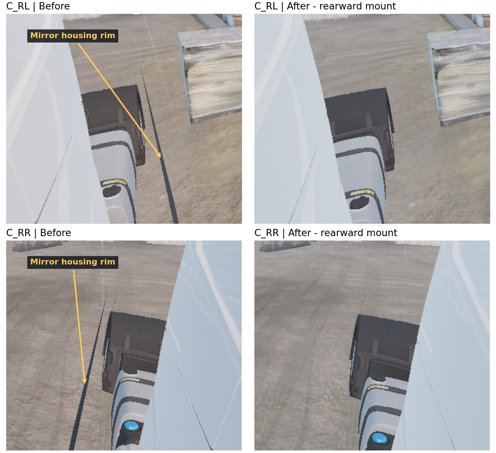
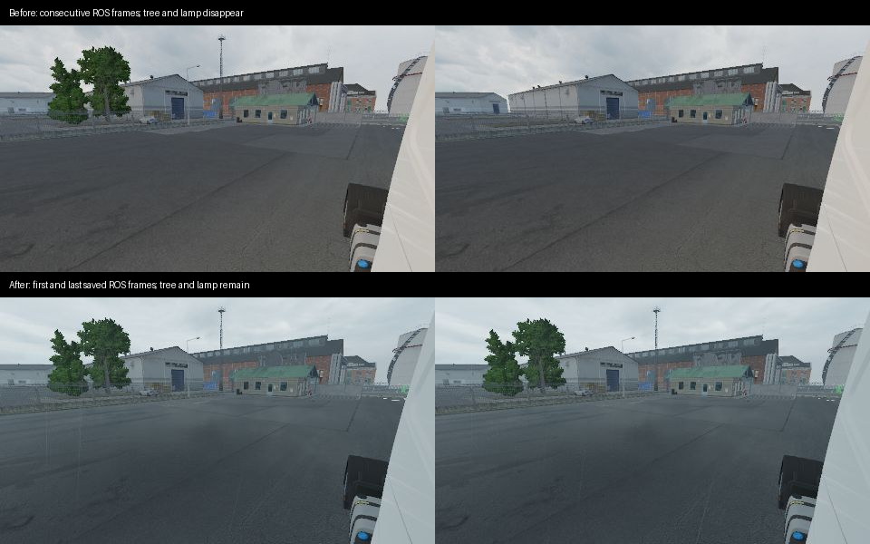

# 주요 실패와 해결

## 미러 하우징 띠를 바닥 구조로 오판

측후방 영상의 얇은 대각선 띠를 정비소 피트 경계로 잘못 지목했습니다. 사용자가 야외 영상과 정확한 위치를 제시한 뒤 해당 픽셀의 RGB·depth를 full ego off/on/off로 비교했습니다.

왼쪽 `(225,450)`은 full ego on에서 RGB `[77,79,88]`, 깊이 0.104009m였고, off에서는 지면 4.138608m였습니다. `mirror_01.pim`의 piece 3, `mat_0003_plastic_base`, triangle 2251과 ray 교차 깊이가 0.103999m로 일치했습니다. 원인은 센서 앞의 미러 하우징 테두리였습니다.

측면 광학 중심을 약 155.8mm 뒤·9.4mm 안쪽·4.7mm 아래로 옮겼습니다. 하우징 뒤쪽 표면에서 뒤 방향 35mm 브래킷을 두고 차체·연료통·휀더를 유지했습니다. 전방 하단 띠도 선바이저 뒤에 있던 장착점을 바깥 표면으로 옮겨 제거했습니다. 문제 픽셀의 직접 깊이와 메시 교차를 먼저 확인하는 방식으로 바꿨습니다.

## 원래 미러의 차체 제외 목록

기존 미러용 geometry subset을 센서에 재사용하면서 캐빈·연료통이 빠지고 바퀴만 나타났습니다. `0xA3CAD0` 경로가 원본 미러 mask로 캐시한 부분 목록을 선택했습니다. 현재 플레이어 body 모델의 센서 pass에서 엔진 full-list 경로를 사용해 RGB·depth 외판을 복구했습니다. 트레일러 body는 연결 후 같은 제출 경로의 적용 범위를 확인합니다.

## 텍스처 ID 재사용과 기본 미러 훼손

미러 0·2는 같은 pool 리소스를 시간차로 사용합니다. image ID 하나에 이름 하나를 붙이거나 Present 마지막에 일괄 복사하면 다른 시점의 픽셀이 섞였습니다. pass 명령 구간에 이름을 붙이고 해당 타깃을 떠날 때 복사하도록 바꿨습니다.

센서가 기본 미러 슬롯·출력을 빌렸을 때 HUD에 `far/close` 더미 영상이 나타났습니다. 카메라와 drawable을 같은 index의 private 배열로 함께 제공하고 `ot/sensorN` 출력과 alias 0xffff로 분리했습니다. 현재 FH5의 기본 미러 0·1·2·5와 센서 3·4·6·7이 공존합니다.

## 캡처 프레임 예측

Present 번호를 +1/+2로 예측하던 방식은 캡처 한 번에 센서를 두 번 렌더했습니다. 현재는 다음 select 호출이 대기 묶음 하나를 가져가고 pass의 실제 Present ID를 따릅니다.

## 센서 렌더 생략과 정적 물체 깜빡임

비수집 프레임의 센서 렌더를 생략하자 정차 상태에서도 나무·가로등이 영상과 라이다에서 반복해서 사라졌습니다. ROS·GPU pack을 뺀 30 Hz 엔진 원본 수집에서도 재현됐고, 연속 렌더에서는 유지됐습니다. 가시성 제출만 계속하고 graph의 drawable을 NULL로 건너뛰는 실험도 실패했습니다. 엔진 내부에서 이력을 잃는 정확한 지점은 남은 조사 대상입니다.

0.24.1은 활성 리그를 매 프레임 렌더하고, pack·readback만 요청 주기에 맞춥니다. 새 리그의 첫 장면 준비가 끝날 때까지 stream 선택을 늦춰 시작 첫 영상의 누락도 제거했습니다. private 배열은 이전 queued graph가 끝난 뒤 갱신합니다.

같은 정차 장면에서 네 카메라·GT 각 973회, 라이다 각 354회를 ROS로 받았습니다. 저장한 C_RR 650장 모두 문제 나무를 유지했고, L_PR 250회의 해당 영역 중앙 거리는 42.57089–42.57121m였습니다. 네 카메라·GT의 stamp가 모두 같고 라이다 stamp도 카메라 표본에 포함됐습니다. 수신 주기는 시뮬레이션 stamp 기준 카메라 27.42 Hz·라이다 9.96 Hz였습니다. 전경 FPS 비교는 후속 측정입니다.

원본 표본: 로컬 `research/live/2026-10-09-visibility/`의 `raw-stream`, `raw-stream-fixed`(graph만 생략한 실패 실험), `raw-stream-continuous`, `bridge-final`.

## 조사 중 캡처 종료 충돌

2026-10-09에 rgbd8 이후 raw 캡처를 시도했을 때 OT_Bundles 용량 부족 오류가 났고, 이어진 패닉 정리 중 게임이 한 번 종료됐습니다. fault는 엔진 렌더 명령 컴파일의 RVA `0x2B1C2C`였습니다. 크래시와 DLL 로그는 로컬 `research/live/2026-10-09-visibility/manual-capture-crash.txt`, `manual-capture-core.log`에 보존했습니다. 형식 전환·hook 해제 중 어느 단계가 원인인지는 미해결입니다. 이후 비교는 형식별로 core를 재초기화하고 진행했습니다.

## 재질 Z와 geometry 깊이

잎 셰이더는 deferred attributes Z에 `2 * mask.b * normal_eye.z`를 더합니다. DSV는 rasterized geometry 깊이를 유지합니다. 원거리에서 두 값을 섞으면 깊이 차이가 생겼습니다. 센서 깊이는 DSV를 실제 projection·viewport로 복원하고, attributes Z는 재질 연구 경로에 남겼습니다.

## SDK 시각·단위

SDK frame_end 다음에 렌더 보간·카메라·가시성 준비가 이어집니다. 이동 차량 박스를 SDK 자세로 곧바로 투영하면 영상과 시각이 어긋납니다. GT는 pass 시점 렌더 모델 자세를 사용합니다.

SDK 각속도는 회전/초, 바퀴 조향은 회전 단위입니다. 0.22.0까지 ROS VehicleState의 rad/s 필드에 2π 변환이 빠져 있었습니다. 0.23.0부터 변환을 적용하며 이전 bag은 읽을 때 보정합니다. SDK 가속도는 차량축 속도 차분의 10-step 평균입니다. IMU는 월드 속도 차분·중력·장착점 회전 가속도로 specific force를 계산합니다.

## pause와 재생

pause 중 센서 준비와 시계 처리를 섞으면 상태 전송이나 재개가 끊겼습니다. SDK 상태와 정지된 clock은 계속 보내고 pause 센서 묶음은 버립니다. 기록은 수신 시각을 사용하며, 재생은 기록된 clock을 발행합니다. 13.26초 pause와 재개 후 센서 정렬을 실제 MCAP 재생으로 확인했습니다.

## 성능 측정과 전달

- 백그라운드 FPS 제한 때문에 초기 약 30Hz 수치가 수집 비용을 드러내지 못했습니다. 이후 측정은 전경 표본과 같은 세션·장면으로 통일했습니다.
- 렌더 스레드 Map·대용량 복사와 반복 버퍼 생성이 프레임을 늘렸습니다. 재사용 버퍼·공유 텍스처·fence로 readback을 중계기로 옮겼습니다.
- 프로세스 내부 관측의 반복 ReadProcessMemory와 pass 문자열 스캔 비용을 SEH memcpy·pass 식별·비수집 callback 조기 종료로 줄였습니다.
- 두 TCP 경로로 영상 송신과 상태 응답을 분리했습니다. WSL localhost 경로는 약 0.55Gbps, eth0 직접 연결은 약 6.1Gbps의 중간 종료 표본을 얻어 직접 연결을 채택했습니다.
- Python 기록에 XYZ를 중복 저장하자 worker를 늘려도 누락이 남았습니다. 빔 range·설정으로 XYZ를 복원하고 실시간 경로는 GPU gather로 옮겼습니다.

현재 성능 표와 남은 CPU·드라이버 경합 가설은 [성능 진단](../18_performance.md)에 있습니다.

## 개발 환경

RenderDoc으로 시작한 첫 게임이 Steam에서 새 프로세스로 재실행돼 캡처 연결이 빠졌습니다. 조사 실행에 임시 App ID 설정을 사용했고 캡처 뒤 제거했습니다. RenderDoc Python 스크립트는 내장 환경에서 실행해야 renderdoc 모듈을 사용할 수 있습니다.

Zsh에서 Bash용 ROS setup을 source하면 setup 경로가 잘못 계산됐습니다. `ros-env.sh`가 셸에 맞는 setup을 선택합니다. 런처는 Bash 환경을 직접 준비합니다.

## 외부 플러그인의 문서와 소비 코드

조사한 ETS2LA/plugin `3b01d90b5be24`의 입력 README는 18바이트·float timestamp, 실제 InputMemData는 26바이트·double timestamp 두 개였습니다. 입력 만료도 예제의 1초와 구현의 0.2초가 달랐습니다. M8은 선택 revision의 구조체·생산자·소비자와 시계 기준을 함께 맞춰야 합니다.

같은 revision의 경로 생산자는 점 개수로만 변경을 판단해 같은 길이의 경로 갱신을 놓칠 수 있고 고정 용량 복사도 확인이 필요했습니다. 경로 연결은 실제 좌표·경로 식별자·길이를 계약으로 사용합니다. 단순 shared-memory memcpy의 동시 읽기 문제는 현재 프로젝트의 원자적 슬롯 소유권으로 처리합니다.
