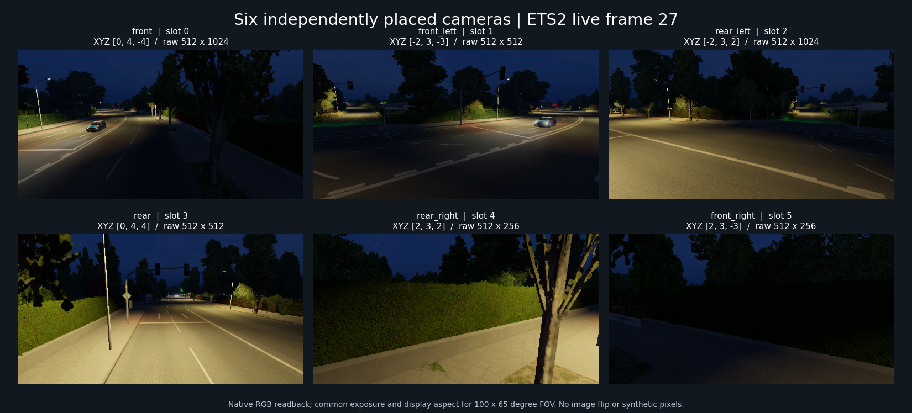

# ot 0.10.0 — 자유 배치 6카메라

> **확정:** 기존 미러 슬롯 0–5를 임의 위치·회전·FOV의 센서로 전용했습니다. 서로 다른 샤시 상대 위치의 여섯 영상을 같은 Present 구간 27에서 수집했습니다. 월드 고정 카메라도 동작합니다.
> **다음:** 센서 해상도 통일과 실시간 미리보기, 주행 중 갱신 및 메인 카메라 기준 가시성·LOD의 누락 해결. 저장 경로 최적화보다 실제 카메라 사용성을 우선합니다.

### 자유 배치 리그 사용

게임 옆 `ot_runtime/ot_config.json`의 `allow_camera_rig`, `allow_tier1`, `allow_render_probe`, `singleplayer_research`를 켜야 합니다. 저장소 기본 설정은 모두 꺼져 있습니다. 연구 PC에는 권한을 적용했으며 시작 상태는 계속 Tier 0입니다.

프로젝트 루트에서 실행합니다. 콘솔 입력이나 게임 재실행은 필요 없습니다.

```powershell
.\ot\ot.cmd camera_rig apply --config .\ot\presets\surround-six.json
.\ot\ot.cmd capture_mirrors arm
.\ot\ot.cmd capture_mirrors status
# phase가 ready이면 RGB·깊이·재질·카메라 상수 저장
.\ot\ot.cmd capture_mirrors save
.\ot\ot.cmd panic
```

`camera_rig apply`는 probe와 Tier 2 리그를 켭니다. `camera_rig off`는 기본 미러로 복귀하고 관측 hook은 유지합니다. `panic` 또는 F11은 리그와 여덟 hook을 모두 끕니다. `capture_mirrors`는 arm 때 설정된 리그 슬롯을 묶으며, 리그가 없으면 기존 0·1·2·5를 요청합니다.

[surround-six.json](presets/surround-six.json)의 각 view에서 다음을 바꿉니다.

- `slot`: 기존 출력 슬롯 0–5. 새 카메라 객체나 엔진 슬롯 확장은 필요하지 않습니다.
- `basis`: `chassis`는 렌더 보간된 본체 기준, `world`는 절대 월드 좌표입니다. 캐빈 서스펜션과 운전석 시점은 상대 배치의 입력에 사용하지 않습니다.
- `position`: XYZ. 샤시 기준 +X 오른쪽, +Y 위, -Z 앞입니다. 단위는 게임 길이 단위입니다.
- `quaternion_wxyz`: 카메라에서 기준 좌표계로의 회전. 단위 회전은 -Z를 봅니다. yaw·pitch·roll을 함께 지정할 수 있습니다.
- `hfov_deg`, `vfov_deg`: 가로·세로 FOV. 현재 출력 크기는 기존 미러 크기이므로 두 FOV와 원시 화면 비율을 별도로 취급합니다.



그림은 같은 Present 구간의 실제 RGB를 공통 노출과 FOV 비율로 표시한 것입니다. 원시 크기는 슬롯 순서대로 512×1024, 512×512, 512×1024, 512×512, 512×256, 512×256입니다. 이미지 flip은 하지 않았습니다. 원본 픽셀·DSV·재질은 그대로 보존합니다.

구현은 `0x5389CD`에서 센서 요청 bit를 합치고, `0x538B11`에서 제출 함수의 RBX만 private camera 복사본으로 돌립니다. 엔진이 그 복사본의 pose/FOV로 렌더 카메라와 후보 선택 frustum을 만듭니다. 원래 미러 객체는 수정하지 않습니다. `0x538CE3`에서 사용 종료를 추적하며, 패닉·언로드는 복사본을 사용하는 호출이 끝날 때까지 종료 hook을 유지합니다. 카메라 생성자의 Z축 반회전을 보정해 일반적인 pinhole 좌표계를 제공합니다.

임의 yaw/pitch/roll을 함께 넣은 월드 카메라의 요청 회전과 실제 pass 회전 차이는 최대 9.01e-8, 위치 차이는 4.70e-6 게임 길이 단위였습니다. 최종 6뷰는 서로 다른 위치·방향과 아래로 8° 기울어진 리그입니다. 원본은 로컬 `research/live/2026-10-08-camera-rig/world-oblique-corrected.json`, `surround-six-final.json`에 있습니다. 운전석 고개 조작·장시간 주행 시험과 원거리 객체 누락 측정은 아직 수행하지 않았습니다.

CLI로 6뷰 리그를 적용한 상태에서 메타로더 `unload`/`load`도 실제 실행했습니다. private 제출 호출·여덟 hook의 임시 코드가 정리됐고, 새 모듈은 Tier 0·hook 0·SDK 9채널로 돌아왔습니다. 기존 FFB는 유지됐습니다. 기록은 로컬 `active-unload.json`입니다.

0.9.0의 `OT_Bundles`는 선택적 공유 메모리 전달입니다. `publish` 후 `otpy.BundleReader`로 읽고 `otpy.bundles.save_bundle`로 Python에서 저장할 수 있습니다. `save_partial`/`publish_partial`은 누락 뷰를 명시한 진단 표본에만 사용하며 완전한 센서 묶음으로 간주하지 않습니다. 연속 GPU staging ring과 기록 CLI는 후순위입니다.

### 0.8.4 — 차량별 GPU 변환 상수

`render_probe on --vehicles`로 수집하면 차량의 draw 목록과 **VS slot 0 상수 버퍼 원본**도 저장합니다. 메타로더 API로 기능 DLL을 교체했으며, 일반 DX11에서 첫 네 뷰의 차량 draw 16개(AI 6·주차 차량 10)를 읽었습니다. CPU 모델·카메라 자세로 계산한 박스 꼭짓점과 GPU 변환 행렬의 투영 차이는 최대 **0.0000188 px**였습니다. 이는 이 표본의 변환 대조이며 AI 픽셀 식별이나 모든 shader의 정합 결과는 아닙니다.

- `geometry_pass.vehicles_at_compile.vehicles[].draws`: 해당 모델 geometry에 연결된 draw 항목과 VS 상수 구간입니다. 빈 배열은 관측된 연결이 없다는 뜻입니다.
- `geometry_gpu.vehicle_constant_buffers`: actor·geometry·draw index, 원본 buffer, 16-byte 단위의 시작/길이와 저장 파일을 연결합니다. 원본은 `mirror*_vehicle_*_vs_cb0.bin`입니다.
- 상수는 G-buffer를 떠날 때 그 draw가 참조한 구간만 GPU staging에 복사합니다. 기존 이미지 완료 query로 함께 회수하고 파일 저장은 명령 worker가 담당합니다.
- 새 관측 지점 `0x2E6243`은 렌더 준비의 묶음 단위로 호출됩니다. 앞 draw의 바인딩을 재사용하는 경우도 순서대로 복원합니다. 최종 `Draw*` 실행을 개별 hook한 것은 아닙니다.
- draw 관측은 `--vehicles`에서만 수행합니다. 다섯 hook 모두 패닉에서 꺼지고 메타로더 unload에서 해제됩니다. 기본 Tier 0은 SDK만 수신합니다.

첫 표본은 뷰별 draw 6/4/6/0개, 추가 상수 데이터 합계 4 KiB였으며 읽기 오류와 관측 예산 초과는 없었습니다. 짧은 관측에서 새 callback 본문은 묶음당 평균 3.09 µs, 최대 270.1 µs였습니다. 전체 hook·GPU 비용이나 주행 성능 측정값은 아닙니다. 근거와 해석은 [차량 draw 상수 경로](../docs/12_dx11_mirror_render_path.md#차량-draw와-gpu-상수-구간의-연결)에 있으며 실행 원본은 로컬 `research/live/2026-10-08-object-projection/0.8.4/`에 보존합니다.

최종 빌드로 두 번째 묶음의 13개 draw도 대조했습니다. 두 묶음 29개 draw의 최대 투영 차이는 0.0000217 px였습니다. 차량 수집을 끈 기본 동작, 다섯 hook의 코드 복원과 완전한 DLL 해제, FFB 유지·SDK 9채널 재수신을 확인했습니다.

### 0.8.3 — 미러 pass의 차량 렌더 모델 관측

`render_probe on --vehicles`로 선택한 경우에만 차량 메타데이터를 추가로 읽습니다. Python API는 `Client().request("render_probe", enabled=True, vehicle_metadata=True)`입니다. Tier 1 권한은 기존과 같으며 `panic` 또는 probe off가 추가 읽기도 끕니다. 일반 `render_probe on`과 로더 재로딩의 기본값은 꺼짐입니다.

기존 compile-begin hook에서 pass의 준비된 draw 항목 `Q`와 AI·주차 차량 본체의 LOD geometry를 교차시킵니다. 각 Q의 추가 component 묶음이 실제 `pp_model_simple` 성분을 참조하는지 확인한 뒤 `images.json`의 `geometry_pass.vehicles_at_compile`에 다음을 저장합니다.

- actor·model·model object·component 주소, LOD index, 해당 geometry 주소
- 렌더 성분의 회전·local XYZ·cell·월드 원점, 모델의 기준점 보정값
- 별도로 읽은 simulation actor pose와 그 원점 기준 AABB
- compile 관측 QPC 구간, 읽기 오류·한도에 의한 생략, pass의 상태 override 수

사용하지 않는 LOD 전체를 현재 자세로 출력하지 않습니다. 소스 geometry가 있는데 준비된 draw 그룹이 없으면 차량 메타데이터에 오류를 남깁니다. 픽셀 수집은 계속 가능하며, 차량 메타데이터를 요청하지 않은 캡처의 경로는 유지합니다. trailer·부가 부품, 개별 draw의 최종 GPU 상수 및 픽셀 객체 ID는 이 기능의 수집 범위에 포함되지 않습니다.

실제 게임에서 네 뷰 묶음 3개를 수집했습니다. 첫 Present 구간 19의 미러 0·1·2·5는 각각 차량 모델 3·3·4·0개였으며 중복을 제거하면 AI 3대·주차 차량 3대였습니다. 각 pass의 준비 그룹은 7개, 상태 override 기록은 0개였고 오류·생략은 없었습니다. 이후 구간 16·49는 별도 관측 세션의 번호이며, 같은 AI 모델 원점이 두 표본 사이 약 5.40 게임 단위 이동했습니다. 차량 메타데이터 읽기 시간은 이 12개 pass에서 0.194–0.285ms였습니다. 전체 GPU 비용이나 장기 FPS 영향의 측정값은 아닙니다.

최종 빌드에서도 옵션을 끈 네 뷰 수집이 완료됐고 차량 필드는 생성되지 않았습니다. 같은 hook을 유지하며 옵션을 켠 다음 묶음에는 모델 2·4·5·0개가 들어왔고 오류·생략은 없었습니다. 패닉 후 hook·callback 수 0, 옵션 꺼짐, 로더를 통한 완전한 core 교체·재로딩과 SDK/FFB 유지도 확인했습니다. 최종 표본은 `final-build-capture.json`입니다.

actor와 model 원점은 같지 않습니다. 첫 표본에서 모델 기준점 보정을 뺀 잔차는 AI에서 약 0.029–0.108 게임 단위, 주차 차량에서 약 0.006–0.033단위였습니다. 이 잔차 전체를 보간 오차라고 단정하지 않습니다. 후속 코드 추적으로 actor 박스가 모델 박스에 같은 기준점 이동량을 더한 값임을 확인했습니다. `project_boxes --pose model`은 `P_model + R_model × (actor_local_point − offset)`으로 투영합니다. 기본값 `--pose actor`는 기존 simulation 관측값을 사용합니다. [변환 근거와 실제 비교](../docs/12_dx11_mirror_render_path.md#actor-박스를-렌더-모델-자세로-옮기는-변환)를 참고하세요. 후속 0.8.4의 GPU 상수 대조는 위 절에 정리했습니다. 이 단계의 실행 자료는 `research/live/2026-10-08-object-projection/0.8.3/` 및 `origin/`에 있습니다.

### 오프라인 객체 박스 투영과 가림 판정

```powershell
.\ot\ot.cmd project_boxes '<capture-directory>' --objects actors.json --output boxes.json
# 0.8.3에서 --vehicles를 켜서 저장한 캡처는 내장 actor 관측값 사용 가능
.\ot\ot.cmd project_boxes '<capture-directory>' --output boxes.json
```

NumPy를 사용하는 오프라인 명령이며 게임 연결 없이 저장된 0.8.2 이후 캡처를 읽습니다. `actors.json`은 외부 메모리 reader와 같은 필드의 JSON 배열입니다. 각 항목에는 `address`, `placement.world_xyz`(3개), `placement.quaternion_wxyz`(4개), `aabb_raw`(로컬 min XYZ, max XYZ 순서의 6개)가 필요합니다. 추가 필드는 무시합니다. `--objects`를 생략하면 0.8.3 차량 메타데이터의 actor 관측값과 읽기 범위를 사용합니다. 좌표는 게임 월드 단위이며, simulation actor pose를 받았다고 해서 렌더 시각으로 보간하지 않습니다.

```powershell
# 0.8.3 --vehicles 캡처의 모델 자세와 기준점 보정 사용; DLL 재교체 불필요
.\ot\ot.cmd project_boxes '<capture-directory>' --pose model --output model-boxes.json
```

`--pose model`은 캡처에 저장된 AI·주차 차량 body model 성분을 사용하므로 `--objects`와 함께 쓰지 않습니다. 결과의 `actor_origin_range_game_units`는 선택한 자세에서 actor 로컬 박스 원점의 거리입니다. actor 모드에서는 simulation 원점, model 모드에서는 `P_model − R_model × offset` 기준입니다. 최종 draw의 GPU 자세·trailer·부가 모델·픽셀 객체 ID를 확인한 결과로 해석하지 않습니다. 실제 여섯 캡처에서 두 모드의 박스와 DSV 비교를 실행했고, 노란 주차 트럭의 RGB 겹침을 확인했습니다. 두 연속 표본의 AI 박스는 모두 앞의 깊이에 가려져 움직이는 AI의 영상 정합은 미검증입니다.

출력은 카메라 frustum으로 잘라낸 박스의 12개 모서리 중 보이는 선분, 투영 영역의 픽셀 수, 유효 깊이 부재·박스 내부 깊이·앞의 가림·박스 뒤 깊이 개수입니다. 깊이는 DSV에서 복원하며 각 픽셀 광선의 OBB(회전한 3D 상자) 진입/이탈 거리와 비교합니다. 박스 중심까지의 거리를 표면 깊이 정답으로 삼지 않습니다. `segments_px`는 원시 영상 행 방향을 보존한 픽셀 경계 좌표입니다. 기존 출력은 덮어쓰지 않습니다.

실제 네 미러의 Present 구간 55에 대해 객체 56개의 외부 관측 자료를 넣어 실행했습니다. 약 130 게임 길이 단위 거리의 주차 트럭은 미러 0·1의 RGB와 박스가 겹쳤고, 박스 영역 422·237픽셀 중 각각 109·79픽셀이 박스 내부 깊이였습니다. 나머지는 앞의 나무 등에 가리거나 상자 뒤 배경을 보고 있었습니다. 약 56단위 거리의 다른 주차 차량은 미러 0·1의 박스 영역 514·136픽셀 모두 차고 벽에 가렸습니다. [두 뷰의 주차 트럭 확대](../research/live/2026-10-08-object-projection/cli-parked-truck-crops.png)를 확인했습니다. 색상은 보기 위한 노출 조정이며 원시 행 순서를 유지했습니다.

객체 읽기는 캡처 전후 약 93.28ms에 걸쳤습니다. 해당 주차 트럭의 위치는 같았지만 비교한 AI들은 0.43–1.16단위 이동했습니다. 따라서 이 결과는 정적 객체의 월드 정합을 지지하며, 움직이는 AI의 같은 프레임 정답·객체별 픽셀 라벨·거리별 정확도 측정은 아닙니다. 박스는 차량 표면보다 넓으므로 내부 깊이 비율 자체도 검출 정확도가 아닙니다. 실측 자료는 `research/live/2026-10-08-object-projection/`에 보존합니다.

### 0.8.2 — 실제 DSV 깊이와 attributes Z 비교

저장된 캡처를 게임 접속 없이 점군으로 복원하는 명령을 추가했습니다. NumPy가 필요하며 다른 pipe·공유 메모리 명령에는 새 의존성이 없습니다.

```powershell
# <capture-directory>는 capture_mirrors save가 반환하는 각 saved_directory
.\ot\ot.cmd reconstruct '<capture-directory>' --output geometry.npz
.\ot\ot.cmd reconstruct '<capture-directory>' --depth-source attributes --output shading-z.npz
```

기본 `geometry`는 DSV를 캡처한 viewport와 CPU pass 투영으로 역투영합니다. `attributes`는 게임의 deferred ray에 `attributes0.w`를 곱하므로 재질의 Z 보정도 포함합니다. 어느 쪽도 다른 쪽으로 자동 대체하지 않습니다. NPZ에는 픽셀 배열을 유지한 `xyz_camera`(float32), `xyz_world`(float64), `valid`(bool), `material_bits`(uint8), JSON 문자열 `metadata_json`이 들어 있습니다. `np.load(path, allow_pickle=False)`로 읽을 수 있으며 기존 출력 파일은 덮어쓰지 않습니다. 무효 픽셀은 NaN입니다.

월드 좌표는 `geometry_pass.camera_at_compile`의 기본 회전·원점을 사용하며 단위는 `game_length_units`입니다. projection modifier가 켜진 표본은 아직 해석하지 않습니다. 개별 draw의 별도 투영이나 billboard를 실제 입체 물체의 형상으로 바꿔 주는 기능은 아닙니다. 두 깊이 경로 모두 같은 pass 카메라로 복원하고 출처·관측 구간을 NPZ에 남깁니다.

Present 구간 60의 네 미러를 두 방식으로 실제 실행해 각 방식당 1,413,986개의 유효 점을 얻었습니다. 별도로 저장해 둔 GPU 상수 기반 DSV 복원과 비교했을 때, 새 CPU pass 기반 카메라 Z의 최대 차이는 1.53e-5 게임 길이 단위였습니다. [월드 점군과 재질별 Z 차이 그림](../research/live/2026-10-08-render-probe/0.8.2-world-reconstruction/geometry-world-and-material-offset.png)을 확인했습니다. 이는 같은 캡처의 두 상수 경로 대조이며 실제 거리 정확도의 검증은 아닙니다.

G-buffer 종료 시 현재 바인딩된 depth-stencil Texture2D도 복사합니다. 실제 게임의 형식은 `D32_FLOAT_S8X24_UINT`였으며 호환되는 typeless staging 텍스처로 전체를 복사하고 기존 query 뒤에 회수했습니다. `<camera>_geometry_depth.bin`은 픽셀당 8 bytes의 원본입니다. 앞 32 bits는 float depth, 다음 8 bits는 stencil이며 나머지는 해석하지 않습니다. `geometry_gpu.depth_texture`에 형식·크기·행 길이·원본 리소스를 기록합니다. 기존 attributes Z를 이 값으로 자동 대체하지 않습니다.

Present 구간 60에서 네 미러의 원본 DSV를 확보했습니다. 카메라 0·2는 같은 원본 depth 텍스처를 재사용하므로 각 geometry 종료 시점에 따로 복사했습니다. 묶음당 원시 이미지가 33 MiB에서 44 MiB로 늘고 VS/PS 상수 2 KiB가 추가됩니다. 지원 코드는 D32 및 D24 계열을 구별하지만 이번 실제 시험은 D32+stencil 경로입니다.

같은 묶음의 GPU 투영행렬과 실제 viewport로 DSV를 카메라 Z로 역투영한 뒤, 유효한 attributes Z와 픽셀별로 비교했습니다. 0·비유한 Z와 material bit 16은 제외했습니다. 표의 값은 **두 렌더 경로의 차이**이며 실제 물체까지의 미터 오차가 아닙니다.

| 미러 | 유효 픽셀 | 절대 Z 차이 중앙값 | p95 | 최댓값 |
| --- | ---: | ---: | ---: | ---: |
| 0 | 512,770 | 0.001807 | 0.007455 | 1.3814 |
| 1 | 256,530 | 0.001794 | 0.006992 | 1.3471 |
| 2 | 513,614 | 0.001702 | 0.007279 | 1.4046 |
| 5 | 131,072 | 0.000687 | 0.002490 | 0.003906 |

DSV에서 얻은 Z를 CPU 기본 반올림으로 FP16 변환하면 일치율이 약 50%였습니다. Direct3D의 높은 정밀도→낮은 정밀도 float 변환은 0 방향 절삭을 사용합니다([공식 규격 §3.2.2](https://microsoft.github.io/DirectX-Specs/d3d/archive/D3D11_3_FunctionalSpec.htm)). 이 규칙으로 비교하면 0–30 게임 길이 단위 영역의 일치율은 뷰별 약 99.98% 이상입니다. 일반적인 FP16 양자화와 일관되는 결과입니다.

원거리 일부 픽셀의 차이는 FP16 절삭만으로 설명되지 않습니다. 최대 차이는 mirror2의 `(y=592,x=142)`에서 attributes Z `-162.5`, DSV 복원 Z 약 `-163.9046`이었습니다. 큰 차이는 packed material 값 `2`에 집중됐습니다. 후속 정적 분석에서 `eut2.leaves`의 defattr pixel shader가 `attributes0.w = eye_z + 2 * mask_texture.b * input_normal_eye.z`를 기록하고, `SV_Depth`는 출력하지 않는 경로를 찾았습니다. 같은 GLSL에서 bit `2`는 billboard 분기, bit `8`은 전환 구간을 표시합니다. 이 플래그를 게임 전체의 의미론적 클래스 ID로 해석하지 않습니다.

SM5 DXBC에서도 법선 Z와 마스크 채널의 곱을 두 번 더해 `o0.w`에 넣는 명령을 확인했습니다. 따라서 attributes Z와 DSV는 재질에 따라 의도적으로 달라질 수 있습니다. 현재의 최대 차이 픽셀을 생성한 draw까지 직접 추적한 것은 아니므로 모든 잔차를 이 식으로 설명했다고 주장하지 않습니다. 이전 RenderDoc 네 미러 G-buffer의 실제 rasterizer state는 모두 depth bias 0이었습니다. 근거는 [12번 후속 셰이더 분석](../docs/12_dx11_mirror_render_path.md#잎-billboard의-z-보정과-dsv-차이)에 정리했습니다.

[깊이·차이 영상](../research/live/2026-10-08-render-probe/0.8.2-depth-comparison/comparison.png)을 확인했고 DSV 복원 Z·절대 차이 NPY를 보존했습니다. 수집 원본은 `0.8.2-depth-gpu.json`, 수치는 `0.8.2-depth-comparison/summary.json`과 `rounding-and-range.json`입니다. 수집 후 패닉·로더 재로딩으로 새 depth staging 자원까지 정리했습니다.

### 0.8.1 — 같은 영상의 GPU geometry 상수 대조

기존 OM hook에서 해당 미러의 G-buffer를 떠나기 직전 VS/PS slot 0의 실제 바인딩 범위와 viewport를 수집합니다. CPU pass 상태는 기존처럼 컴파일 시점에 보존합니다. VS/PS raw 파일과 `geometry_gpu` metadata가 기존 이미지 묶음에 추가되며 `images` 배열과 기존 CLI는 그대로입니다. 추가 hook은 없습니다.

`VSGetConstantBuffers1`·`PSGetConstantBuffers1`에서 시작 위치와 길이를 받아, 해당 범위를 작은 staging buffer로 GPU 복사합니다. 바인딩 offset의 단위는 16 bytes이며 source buffer 전체를 처음부터 읽지 않습니다. 이미지 복사 뒤의 기존 completion query가 앞서 제출한 상수 복사도 포함하므로 별도 GPU wait 없이 회수합니다. [GetConstantBuffers1 문서](https://learn.microsoft.com/en-us/windows/win32/api/d3d11_1/nf-d3d11_1-id3d11devicecontext1-vsgetconstantbuffers1), [CopySubresourceRegion 문서](https://learn.microsoft.com/en-us/windows/win32/api/d3d11/nf-d3d11-id3d11devicecontext-copysubresourceregion).

저장된 RenderDoc 네 미러의 마지막 geometry draw와 다음 OM binding 사이에는 UAV/SRV 해제와 clear만 있었고 VS/PS shader·상수 변경은 없었습니다(`geometry-exit-api-order.json`). 이 순서가 수집 지점을 고른 근거입니다. metadata의 정확한 관측 시점은 `before_leaving_gbuffer_binding`이며 모든 draw의 상수를 기록한다는 뜻은 아닙니다. geometry의 PS 상수는 fog 상수와 구별합니다.

일반 DX11 PID 24748의 Present 구간 61에서 네 영상과 GPU VS/PS 상수 8개를 실제 수집했습니다. 각각 256 bytes이며 원본은 2 MiB constant buffer의 서로 다른 offset에 있었습니다. 네 카메라에서 GPU VS 상수로 분리한 회전 성분과 CPU pass 회전이 정확히 같았고, GPU에서 분리한 투영과 보정한 CPU 투영의 최대 차이는 5.61e-8 미만이었습니다. 실제 GPU viewport의 깊이 범위도 CPU 값과 같았습니다. CPU ray의 세 pixel-center 표본을 실제 GPU 투영으로 되돌린 최대 오차는 0.000022 pixel 미만입니다.

각 GPU 변환의 이동 성분 `t`에서 `camera_world + inverse(R) * t`를 계산하면 네 뷰가 같은 입력 기준 원점을 가리켰습니다. 뷰 간 최대 차이는 1.53e-7 게임 길이 단위였습니다. 이 수치는 CPU/GPU 카메라 변환의 일관성이며 깊이 센서의 거리 오차나 미터 정확도가 아닙니다. 개별 draw override·다른 shader·주행 중 상태 변화는 추가 관측이 필요합니다.

원본은 `research/live/2026-10-08-render-probe/0.8.1-geometry-gpu.json`, 수치 비교는 `0.8.1-gpu-camera-comparison.json`입니다. 각 상수 복사와 이미지 복사는 같은 Present 구간 안에 있었습니다. 캡처 후 패닉·메타로더 재로딩으로 staging buffer와 hook 임시 코드를 정리하고 Tier 0으로 돌아왔습니다.

### 0.8.0 — 영상에 pass 기본 카메라 상태 연결

컴파일 시작 hook에서 미러 surface pass의 작업 자료와 component batch를 읽어 `geometry_pass.camera_at_compile`에 저장합니다. 해당 JSON은 컴파일된 명령 구간과 함께 보존되며 실제 OM binding과 GPU 복사 metadata까지 전달됩니다. 나중에 주소를 다시 읽거나 외부 관측 시각이 가까운 자료를 결합하지 않습니다. 알려진 defattr callback·component 타입의 layout만 해석하며 주소·offset은 컴파일된 `render_pass_camera` 스키마에 있습니다.

내용은 CPU 투영행렬·viewport 깊이/원시 사각형·추가 투영 보정 값, 기본 카메라 회전·local/cell/world 위치, ray float4·렌더 크기와 QPC입니다. `sample_phase`는 `dx11_compile_pass_begin`이며 **pass의 기본 상태**입니다. 개별 draw의 component override나 특수 shader를 모두 확인한 최종 GPU 상태가 아닙니다. `available=false`이면 `error`를 함께 남기고 픽셀 자료는 그대로 보존합니다.

일반 DX11 PID 24748의 Present 구간 54에서 네 영상과 네 기본 카메라를 확보했습니다. 컴파일 시각은 각 GPU 복사 제출보다 3.036–11.042 ms 앞섰습니다. ray 값은 네 뷰 모두 이전 RenderDoc 프레임 3160의 fog 상수와 정확히 같았고, CPU 투영을 DX11 기본 보정한 행렬과 이전 geometry VS에서 분리한 투영행렬의 최대 차이는 9.71e-8 미만이었습니다. 현재 ray와 투영의 세 pixel-center 표본 왕복 오차는 0.000013 pixel 미만입니다. 이는 좌표 규약·고정 투영의 대조이며 **서로 다른 프레임의 카메라 자세나 최종 GPU 상수를 검증한 결과가 아닙니다.**

Z·ray로 카메라 점군을 만들고 기본 카메라 회전의 역행렬과 world 원점으로 변환한 NPY도 저장했습니다. [네 뷰 RGB/Z](../research/live/2026-10-08-render-probe/0.8.0-pass-world/rgb-depth.png), [기본 카메라 기반 월드 점군](../research/live/2026-10-08-render-probe/0.8.0-pass-world/world-pass-base.png)에서 차고 벽·바닥 형태를 확인했습니다. 이 월드 점군은 draw override·AI 박스·미터 정확도를 아직 대조하지 않은 중간 결과입니다.

활성화 후 준비가 끝난 구간의 바인딩 7,916회는 연결 실패·오류가 0이었습니다. 캡처 뒤 패닉 및 로더 재로딩으로 hook·GPU 자원을 정리했고 Tier 0·상주 로더 0.7.0·기능 모듈 0.8.0으로 돌아왔습니다. 원본은 `research/live/2026-10-08-render-probe/0.8.0-pass-camera.json`, 비교값은 `0.8.0-camera-comparison.json`입니다.

### 0.7.2–0.7.3 — 프로세스 내부 읽기와 pass 조회 비용 감소

`copy_memory`는 SEH로 감싼 직접 `memcpy`를 사용합니다. 접근 위반·in-page 오류는 false로 반환하며 호출자는 실패한 목적지를 사용하지 않습니다. 외부 프로세스 reader와 언로드 시 스택 검사 경로는 기존 방식을 유지합니다.

pass 조회는 입력 명령 버퍼의 소유 pass 주소와 `+0x1F8`의 인덱스로 해당 그래프 배열 원소를 확인합니다. 매번 세 버퍼의 모든 pass를 순회하던 루프를 제거했습니다. 인덱스 생성·조회 근거는 `render-pass-create.txt`, `render-pass-accessor.txt`이며 현재 게임의 90개 pass에서도 배열 인덱스 대응을 확인했습니다. 물리 텍스처에 이름 하나를 붙이거나 프레임을 넘어 주소를 캐시하지 않습니다. 기존 명령 구간→pass 연결은 유지합니다.

같은 정차 장면의 각 약 8초 관측에서 hook 본문 평균은 다음과 같았습니다. QPC 경과 시간이며, 전체 hook 비용이나 GPU 성능 개선율은 아닙니다.

| 경로 | OM bind 평균 | compile begin 평균 | compile end 평균 |
| --- | ---: | ---: | ---: |
| 0.7.1 RPM·전체 순회 | 2.901 µs | 50.224 µs | 1.370 µs |
| 0.7.2 직접 복사·전체 순회 | 0.637 µs | 12.969 µs | 0.453 µs |
| 0.7.3 직접 복사·인덱스 조회 | 0.596 µs | 12.447 µs | 0.421 µs |

0.7.3에서 네 미러를 Present 구간 457에 다시 수집했습니다. Z는 모두 유한했고 0·2의 색상 픽셀은 99.9998%가 달랐습니다. hook 활성화 직후 컴파일을 아직 관측하지 못한 바인딩 49개는 미연결로 남았고, 이후 준비를 마친 수집 구간의 4,029개 바인딩은 연결 실패·오류가 0이었습니다. 같은 구간의 픽셀 수집·패닉 후 로더 재로딩으로 hook 임시 코드와 GPU 자원까지 정리했으며 SDK만 켜진 Tier 0으로 돌아왔습니다. 실제 상주 로더는 0.7.0, 기능 모듈은 0.7.3입니다.

원본은 `research/live/2026-10-08-render-probe/0.7.2-memcpy-timing.json`, `0.7.3-indexed-timing.json`, `0.7.3-indexed-capture.json`입니다. 관측된 Present 횟수는 각각 296·380·400이었으나 전경/비활성 제한과 GPU 부하를 통제한 실험이 아니므로 제한 없는 FPS 개선 수치로 사용하지 않습니다.

### 0.7.1 — hook 본문 소요 시간

`hooks`의 각 `timing`은 기능 DLL 수명 동안 누적한 QPC `samples`, `total_ticks`, `max_ticks`, `log2_tick_buckets`입니다. `qpc_frequency`로 나누면 초입니다. bucket 0은 0–1 tick, bucket k는 `[2^k, 2^(k+1))`입니다. 활성 중 조회는 근사 스냅샷이며 `panic` 후 진행 중 callback이 0이면 값이 고정됩니다. DLL을 교체하면 초기화됩니다.

측정 구간은 허용된 callback의 본문입니다. 스레드가 기다리거나 선점된 시간도 포함하며 GPU 시간·순수 CPU 사용량은 아닙니다. detour의 레지스터 저장/복원, callback 진입 카운터, histogram 갱신 비용은 포함하지 않습니다. QPC 측정 자체의 작은 비용은 있습니다.

PID 24748에서 기존 `ReadProcessMemory` 경로로 약 8초 관측했습니다. OM bind 21,124회 평균 2.901 µs, compile begin 47,286회 평균 50.224 µs, compile end 47,285회 평균 1.370 µs였습니다. compile begin 본문 누적 2,374.9 ms가 가장 컸습니다. pass 연결 오류·누락은 0이며 패닉 후 활성 hook·진행 callback은 0입니다. 원본은 `research/live/2026-10-08-render-probe/0.7.1-rpm-timing.json`입니다. 이 비교 조건은 메인 scale 1×1, 미러 scale 2×2, vsync 0, 비활성 FPS 제한 60입니다. 제한 없는 FPS 영향은 별도 측정이 필요합니다.

상주 로더는 0.7.0을 유지한 채 ABI 1로 기능 DLL 0.7.1만 교체했습니다. 로더와 FFB 모듈은 유지됐고 기능 DLL의 실제 메모리 해제·재로딩을 확인했습니다.

### 0.7.0 상주 로더 — 실제 게임 전환·교체 확인

`ot_loader.dll`은 게임의 SDK 플러그인으로 남고, 하위 `ot_runtime/ot_core.dll`을 로드·해제합니다. 게임이 직접 찾는 `plugins/ot_core.dll`과 함께 설치하면 안 됩니다. 최초 전환은 `sdk unload` 후 기존 플러그인을 백업하고 아래 구조로 배치한 뒤 `sdk reload`합니다. 이후에는 기능 DLL만 아래 API로 교체합니다. 로더 자체를 업데이트할 때에는 여전히 SDK 언로드가 필요합니다.

```text
plugins/
  ot_loader.dll             SCS SDK 진입·이벤트 전달·교체 API
  ot_runtime/
    ot_core.dll             교체 가능한 기능 모듈
    ot_config.json          기존 연구 권한과 F11 설정
```

```powershell
.\ot\ot.cmd loader status
.\ot\ot.cmd loader unload
# module_state=unloaded를 확인한 후 ot_runtime/ot_core.dll 교체
.\ot\ot.cmd loader load
# 파일 교체 없이 현재 기능 모듈을 재초기화하려면:
.\ot\ot.cmd loader reload
```

로더 pipe는 `\\.\pipe\ot_loader`, 기능 pipe는 기존 `\\.\pipe\ot`입니다. 두 pipe는 현재 Windows 사용자만 접근할 수 있고 원격 클라이언트를 거부합니다. `load/unload/reload`는 `request_id` 문자열과 함께 한 번 제출하고 `status`로 결과를 조회합니다. CLI는 이 과정을 처리합니다. 서버는 진행 중 요청과 마지막 결과만 보존하고 동일한 마지막 ID는 중복 실행하지 않습니다. 응답을 잃은 요청은 자동 재전송하지 않습니다.

외부 스레드는 교체를 직접 수행하지 않습니다. 로더가 상주 SDK 이벤트 함수를 등록하고, 기능 모듈의 `frame_end` 콜백이 반환한 뒤 SDK 스레드에서 교체합니다. 같은 이벤트 안에서 그 이벤트를 다시 등록할 수 없다는 SDK 제약 때문에 이벤트 전달 함수는 계속 남습니다. 기능 모듈은 채널·이벤트 구독을 해제하고 pipe worker와 렌더 hook을 정리한 뒤 ABI 1의 `stop()`으로 해제 가능 여부를 반환합니다. 정리가 끝나지 않으면 `retained`로 남기며 `FreeLibrary`와 새 모듈 로드를 진행하지 않습니다.

대기 요청은 5초 안에 SDK 프레임 경계가 오지 않으면 만료되며 나중에 실행되지 않습니다. 새 모듈의 초기화가 실패해도 로더 API는 남으므로 파일을 고친 뒤 `load`를 다시 요청할 수 있습니다. hot load에는 현재 SDK configuration의 복사본과 started/paused 상태를 전달합니다. 다른 SDK 플러그인(예: FFB)은 이 API의 교체 대상이 아닙니다.

공유 메모리 reader는 교체 전에 닫고, 교체 후 새 `StateReader`로 연결합니다. 기존 reader가 매핑을 잡고 있으면 새 기능 모듈의 독점 매핑 생성이 실패할 수 있습니다. 시작 권한은 기존 `initial_tier` 설정을 따르며 설치 설정은 Tier 0입니다. 로더 수명은 SDK 종료 또는 게임 정상 종료까지이고, 로더 로그는 `%LOCALAPPDATA%/ETS2AutonomyLab/ot/<PID>/ot_loader.log`입니다.

Python에서도 같은 API를 사용합니다.

```python
from otpy import LoaderClient
loader = LoaderClient()
print(loader.status())
loader.control("unload")
# 기능 DLL 파일 교체
loader.control("load")
```

PID 24748에서 최초 설치 후 콘솔 입력 없이 기능 DLL을 실제 언로드하고 파일을 덮어쓴 뒤 재로딩했습니다. 메모리의 기능 DLL 부재와 기능 pipe 소멸을 확인했고, 로더와 기존 FFB DLL은 유지됐습니다. 네 렌더 hook을 켜고 캡처를 요청한 상태에서도 언로드가 완료됐으며 원래 게임 코드 네 지점이 복원됐습니다. 파일을 잠시 다른 이름으로 옮겨 발생시킨 `LoadLibraryExW failed: 126` 뒤에도 로더 API가 응답했고, 파일 복원 후 로드에 성공했습니다. 완료된 reload 요청 ID를 재전송했을 때 세대 번호가 증가하지 않았습니다.

재로딩 후 네 미러 픽셀 한 묶음(프레임 구간 14)을 다시 저장했고, 마지막 교체에서 hook 임시 코드까지 해제했습니다. 최종 세대 6은 Tier 0·활성 hook 0·SDK 9채널·새 공유 메모리 reader 수신 상태입니다. 차량 configuration 재전달도 `truck_generation=1`로 확인했습니다. 원본은 `research/live/2026-10-08-render-probe/0.7.0-loader-active-unload.json`, `0.7.0-loader-recovery.json`, `0.7.0-loader-final-idle.json`입니다. 로더 자체의 SDK 종료·재로딩, 의도적인 hook 정리 timeout, 장시간 반복 교체는 아직 시험하지 않았습니다.

### 0.6.1 — 같은 Present 구간의 네 미러

일반 DX11 PID 24748에서 프레임 구간 32·41·50의 세 묶음을 확보했습니다. 각 묶음은 미러 0·1·2·5의 색상·attributes0·attributes3, 총 12개 원시 텍스처(33 MiB)입니다. 네 카메라의 복사 제출 시각이 모두 해당 Present 반환 사이에 있음을 확인했습니다. 같은 Present 구간의 렌더 결과이며 SDK 자차 자세·AI 목록까지 같은 시각으로 묶었다는 뜻은 아닙니다.

| 카메라 | 해상도 | 첫 표본 Z 범위 | Z=0 비율 |
| --- | --- | --- | --- |
| mirror0 | 512×1024 | -236.25–0 | 2.196% |
| mirror1 | 512×512 | -188.625–0 | 2.142% |
| mirror2 | 512×1024 | -213.5–0 | 2.039% |
| mirror5 | 512×256 | -6.03516–-0.268066 | 0% |

미러 0·2의 세 원본 Texture2D 주소는 각각 같았지만 세 묶음 모두 색상 픽셀이 100% 달랐습니다. 첫 Z 표본도 99.9128% 달랐습니다. 이름을 물리 텍스처에 붙이는 대신 컴파일된 명령 구간에 연결해, 다른 카메라가 덮어쓰기 전에 복사했습니다. [RGB/Z/재질 비교](../research/live/2026-10-08-render-probe/mirrors-first/comparison.png)에서 차고 기둥·차체·배수구 윤곽을 대조했습니다. 원시 행 방향을 유지하므로 영상은 뒤집혀 보입니다. Z=0은 무효값으로 취급하며, 재질 비트는 의미 분할 클래스가 아닙니다.

```powershell
.\ot\ot.cmd tier 1
.\ot\ot.cmd render_probe on
.\ot\ot.cmd capture_mirrors arm
.\ot\ot.cmd capture_mirrors status
# 네 카메라가 모두 ready일 때 저장
.\ot\ot.cmd capture_mirrors save
.\ot\ot.cmd panic
```

`arm`은 진행 중인 구간을 건너뛰어 다음 완전한 구간을 요청합니다. 그 구간에 렌더되지 않은 카메라가 있으면 오류를 반환하며 다른 구간의 영상을 조합하지 않습니다. 기존 `capture_mirror5`도 유지합니다. 출력 경로는 각 `views[].saved_directory`, 상수·식별 자료는 `views[].metadata`입니다. 아직 공유 메모리 센서 묶음이나 연속 네 뷰 기록기는 아닙니다.

이 실행에서 바인딩 3,900회가 모두 pass에 연결됐고 연결 오류·누락은 0이었습니다. 관측한 Present 간격 중앙값은 33.328 ms, p95는 34.154 ms였습니다. 짧은 정차 표본이며 hook 비용이나 제한 없는 FPS의 대조 실험은 아닙니다. 패닉 뒤 네 지점의 원래 코드, 활성 hook 0·callback 0·Tier 0을 확인했습니다. 이어 `sdk unload` 후 DLL·pipe 부재와 worker·매핑·trampoline·stub 해제 로그를 확인했습니다. 원본과 요약은 `research/live/2026-10-08-render-probe/0.6.1-first-bundles.json`, `0.6.1-bundle-summary.json`, 첫 픽셀은 `mirrors-first/`에 있습니다.

재로딩 후 0.6.1·Tier 0·활성 hook 0·묶음 idle·SDK 9채널 수신을 확인했습니다(`0.6.1-reloaded-idle.json`).

### 0.5.0 — Present 구간과 제한 시간 기록

0.5.0을 일반 DX11 PID 24748에서 실제 실행했습니다. 세 번째 hook은 `IDXGISwapChain::Present` 반환 지점 RVA `0x2BFEDA`를 관측합니다. `frames` 명령은 최근 최대 600개의 호출 순번·QPC 시간·HRESULT·스레드를 반환합니다. 이는 CPU의 Present 호출 간격이며 GPU 실행 시간이나 모니터 표시 시각이 아닙니다.

캡처의 `render_frame_id`는 두 Present 반환 사이의 구간 번호입니다. DLL 인스턴스를 구분하는 `observation_session_qpc`와 함께 사용합니다. 첫 경계를 보기 전에는 캡처를 시작하지 않으며, G-buffer와 색상이 다른 구간에 속하면 해당 후보를 버립니다. `copy_submission_cpu_ticks`와 `readback_cpu_ticks`는 복사 제출·CPU 회수의 실행 시간이며 `qpc_frequency`로 나눠 초로 변환합니다.

```powershell
# 정차 상태에서 5초간 최대 10 Hz로 요청. 종료·예외·Ctrl+C에서 panic 실행
.\ot\ot.cmd record_mirror5 --hz 10 --duration 5 --output .\mirror5-run.jsonl
```

JSONL은 캡처 metadata·원시 파일 저장 경로·Present 기록·실제 처리율을 담습니다. 기존 단일 캡처를 순차 요청하므로 목표 속도를 보장하지 않으며, 지연된 요청은 건너뜁니다. 512×256 세 텍스처는 표본당 3 MiB로 10 Hz에 약 30 MiB/s입니다. 매번 staging 자원을 만드는 초기 구현이며 GPU ring·다중 뷰·MCAP 스트림은 아직 없습니다. CLI가 정상적으로 정리할 수 없는 강제 프로세스 종료에는 `panic` 명령 또는 F11이 필요합니다.

정차 중 5.0002초에 **50표본, 9.9996 Hz**, 요청 슬롯 누락 0회, raw 150 MiB를 기록했습니다. 프레임 구간은 153부터 300까지 3씩 증가했고, 50개 모두 복사 제출 시각이 해당 Present 반환 사이에 있었습니다. Present 기록 손실은 0, HRESULT는 모두 S_OK였습니다. 같은 세 hook으로 픽셀 수집 없이 관측한 5초는 29.996회/s, 수집 구간은 30.001회/s였고 p95 간격은 각각 34.031/34.080 ms였습니다. 이 장면의 약 30 Hz 제출 속도에서는 차이가 관측되지 않았지만, hook 자체 비용·제한 없는 처리율·장시간 FPS 영향까지 검증한 결과는 아닙니다.

복사 자원 준비·제출 CPU 시간의 중앙값은 0.341 ms, readback CPU 시간은 0.414 ms였습니다. GPU 시간은 아닙니다. 마지막 50번 표본의 RGB/Z/재질 그림을 확인했고 Z는 전부 유한·비영, 범위는 `-6.03125~-0.26806640625`였습니다. 세 hook 지점의 원래 코드 복원과 Tier 0·활성 hook 0도 확인했습니다. 이어 사용자 `sdk unload` 후 DLL·pipe 부재와 `Render probe drained; trampoline and stub released` 로그를 확인했습니다. 기록은 `research/live/2026-10-08-render-probe/0.5.0-record-5s.jsonl`, `0.5.0-first-record.json`, `0.5.0-record-summary.json`, 대표 픽셀은 [`mirror5-record-sample50`](../research/live/2026-10-08-render-probe/mirror5-record-sample50/)입니다. 50개 전체 raw 경로는 JSONL에 있습니다. 최종 재로딩에서도 0.5.0·Tier 0·활성 hook 0·캡처 idle·SDK 9채널 수신을 확인했습니다(`0.5.0-reloaded-idle.json`).

## 구현 범위

0.6.0에서 pass 명령 연결을 실제 확인했습니다. `0x227140`은 pass의 명령 버퍼(`+0x2E8`)를 목록에 넣고, renderer slot `+0x108`이 이를 DX11 명령으로 컴파일합니다. `0x2B1B40`/`0x2B266A`에서 입력 버퍼 하나가 만든 출력 token 범위를 기록하고, OMSetRenderTargets 관측 지점에서 실제 token 주소·compiled pool ID로 찾습니다. pass 이름은 그래프의 pass 배열에서 읽고 연결 이미지의 namespace를 함께 보존합니다. 3초 동안 바인딩 6,157회가 모두 연결됐으며 오류는 0이었습니다. 0.6.1은 이전 이미지 생성 hook을 제거해 총 4개(명령 컴파일 시작/끝, 바인딩, Present)만 사용합니다. 0.6.0의 다섯 hook은 패닉 원상 복원과 완전한 SDK 언로드를 확인했습니다. 정적 근거는 `graph-pass-command-submit.txt`, `rt-binding-token-read.txt`, 실제 기록은 `0.6.0-pass-commands.json`입니다.

`dist/ot_loader.dll`이 공식 SCS telemetry SDK 플러그인으로 시작해 기능 모듈 `ot_core.dll`을 관리합니다. SDK 종료 때 두 DLL의 콜백·명령 스레드·pipe·공유 메모리를 정리합니다. 별도 injector나 DXGI 프록시를 사용하지 않습니다.

| 기능 | 현재 구현 |
| --- | --- |
| SDK | world placement, 로컬 선형·각속도, 로컬 선형 가속도, 속력, RPM, 조향·가속·브레이크 입력 9채널 |
| 버전 게이트 | 조사한 EXE의 SHA-256과 시작 시 비교. 불일치 시 내부 주소 접근 차단, SDK만 유지 |
| 내부 읽기 | 설정과 해시가 허용할 때 `sdk_frame_end`에서 미러 배열·pose·projection, PhysX 기반 차량 자세 읽기 |
| 명령 | `ping`, `version`, `hooks`, `frames`, `render_probe`, `capture_mirror5`, `capture_mirrors`, `schema`, `read`, `snapshot`, `state`, `tier`, `panic`, `dump`, `reload_permissions`; CLI `record_mirror5` |
| 렌더 관측 | Tier 1의 `allow_render_probe`와 `render_probe on`으로 네 hook 활성화. pass 명령 구간·D3D 바인딩·Present 반환 관측·요청한 네 미러 GPU 복사 |
| 데이터 | `Local\OT_State`에 JSON 스냅샷. 네트워크 소켓 없음 |
| 패닉 | 게임 창이 전경일 때 F11 또는 pipe `panic`: Tier 0으로 복귀 |
| 진단 | `%LOCALAPPDATA%\ETS2AutonomyLab\ot\<PID>\ot_core.log`, 요청 시 수동 minidump |
| Python | `Client`와 공유 메모리 `StateReader`, CLI |

현재 Tier 0은 **SDK 수신을 유지하고 내부 필드 읽기와 render probe를 끈 상태**입니다. Tier 1에서 내부 읽기와 별도 opt-in 렌더 hook을 지원합니다. ImGui, 카메라 필드 쓰기, Tier 3 게임 동작 패치, `OT_Bundles`, MCAP, Foxglove는 아직 구현하지 않았습니다. `dump`는 수동 진단이며 자동 크래시 덤프 기능은 아닙니다.

### 0.4.1 mirror5 GPU 캡처 — 실제 픽셀 4회 확보

일반 DX11 PID 24748에서 첫 캡처의 렌더 바인딩 28번(G-buffer) → 31번(색상 타깃 이탈)을 연결했습니다. 동일 immediate context·렌더 스레드 18012에서 512×256 RGBA16F 두 장과 RGBA16UINT 한 장, 총 3 MiB를 얻었습니다. SDK 힌트는 둘 다 3755였으나 GPU frame ID는 아직 없습니다. 첫 Z는 전부 유한·비영이며 범위는 `-6.03515625~-0.26806640625`였습니다. RGB와 Z에서 트럭 앞부분·바닥·배수구의 윤곽이 대응했습니다. 이는 정성적 이미지 확인이며 거리 단위·정량 정합 검증은 아닙니다.

이후 세 요청도 성공해 캡처 순번 2·3·4, SDK 힌트 9672·9706·9742를 얻었습니다. 두 hook 지점의 32-byte 원상 복원, callback 0, Tier 0을 확인했습니다. 사용자 `sdk unload` 후 DLL 모듈·pipe 부재와 임시 코드 해제 로그, 재로딩 후 0.4.1·Tier 0·SDK 9채널 등록·캡처 idle도 확인했습니다. 첫 raw·NPY·PNG는 [`mirror5-first`](../research/live/2026-10-08-render-probe/mirror5-first/), 후속 raw는 같은 폴더의 `mirror5-repeat-2..4`에 있습니다. 기록은 `0.4.1-first-capture.json`, `0.4.1-repeat-captures.json`입니다. 표시 이미지는 원시 행 순서를 유지합니다.

0.4.0의 실제 첫 시도에서는 25초 동안 호출이 들어왔지만 이름 연결이 0건이라 GPU 복사를 시작하지 않았습니다. 원본은 `research/live/2026-10-08-render-probe/0.4.0-first-capture.json`입니다. 0.4.1은 렌더 그래프 이미지 생성 코드 RVA `0x21F09D`도 관측해 이름과 image ID의 연결을 보존합니다. 해당 29-byte signature는 설치 EXE에서 한 곳이며, 캡처 요청이 있을 때만 이름을 수집합니다. pool ID가 다른 이름에 재할당되면 이전 연결을 지웁니다.

`capture_mirror5 arm`은 한 장만 요청합니다. callback에서 실제 RTV의 Texture2D와 `mirror5/attributes_0`, `mirror5/attributes_3`, `mirror5/composition_raw`의 image ID → resource를 대조합니다. 같은 context에서 해당 G-buffer를 시작하고 색상을 렌더한 뒤 그 색상 타깃을 떠나는 바인딩에서 세 텍스처를 staging으로 복사합니다. RenderDoc의 해당 전환 다음에는 전방 미러 최종 출력이 있었습니다. 이름 수집 hook까지 포함해 활성 hook 수는 2개이며 패닉·SDK 종료에서 둘 다 해제합니다. 다른 미러와 연속 수집은 아직 없습니다.

GPU API 호출은 게임 렌더 스레드에서만 수행합니다. [CopyResource](https://learn.microsoft.com/en-us/windows/win32/api/d3d11/nf-d3d11-id3d11devicecontext-copyresource) 뒤 EVENT query를 `DONOTFLUSH`로 조회하고, [Map](https://learn.microsoft.com/en-us/windows/win32/api/d3d11/nf-d3d11-id3d11devicecontext-map)은 `DO_NOT_WAIT`로 호출합니다. 완료되지 않았으면 다음 callback으로 넘기며 강제 Flush·대기 루프는 없습니다. CPU로 옮길 때 RowPitch 패딩을 제거하고 원시 행 방향·RGBA16F/UINT 값을 유지합니다. GPU 리소스는 읽기 완료 또는 취소 때 해제합니다.

```powershell
.\ot\ot.cmd tier 1
.\ot\ot.cmd render_probe on
.\ot\ot.cmd capture_mirror5 arm
.\ot\ot.cmd capture_mirror5 status
# phase가 ready이면 기존 명령 worker에서 파일 저장
.\ot\ot.cmd capture_mirror5 save
.\ot\ot.cmd panic
```

출력은 `%LOCALAPPDATA%/ETS2AutonomyLab/ot/<PID>/mirror5-<tick>/`의 `images.json`과 raw 파일 3개입니다. metadata는 마지막에 기록합니다. `capture_sequence`는 DLL의 캡처 순번이며 GPU frame ID가 아닙니다. `sdk_frame_hint` 역시 SDK 힌트입니다. 패닉은 미완료 캡처를 취소하지만 이미 확보한 CPU 픽셀은 저장할 수 있게 유지합니다. 요청 후 30초가 지난 callback에서 timeout을 보고합니다. NPY·PNG 변환에는 기존 `research/live/2026-10-08-renderdoc/convert_pixels.py`에 출력 폴더를 인자로 전달합니다.

### 0.3.0 렌더 호출 관측 — 실제 게임 시험 완료

일반 DX11 게임 PID 24748에서 10초 동안 20,824회 호출을 관측했습니다. 단일 렌더 스레드 18012·단일 D3D context였고 `missed_records=0`이었습니다. 패닉 뒤 활성 hook 0, 호출 수 정지, 원래 게임 명령 바이트 복원, SDK frame 증가를 확인했습니다. 이어 사용자 `sdk unload` 후 DLL 모듈 부재·pipe 부재와 `trampoline and stub released` 로그를 확인했습니다. `sdk reload` 후 버전 0.3.0, Tier 0, SDK 9채널 수신이 복구됐습니다. 원본은 `research/live/2026-10-08-render-probe/first-hook-10s.json`, `reload-and-graph.json`입니다. 짧은 정차 실험이며 장시간 주행이나 GPU 복사 검증은 아닙니다.

RenderDoc 캡처에서 확인한 명령 소비 함수의 `OMSetRenderTargets` 인수 준비 지점에 SafetyHook mid hook을 둡니다. EXE 시작 해시가 일치해야 하고, 실행 영역의 명령 서명이 유일하게 RVA `0x2B3193`에 연결돼야 활성화합니다. 실제 설치 EXE의 오프라인 검색에서도 한 곳이었습니다. `renderdoc.dll`이 로드된 게임에서는 활성화를 거부합니다.

배포 설정은 `allow_render_probe: false`입니다. 연구 실행에서는 설치 설정에 `allow_tier1`, `singleplayer_research`, `allow_render_probe`를 모두 켠 다음 다음 순서로 관측합니다.

```powershell
.\ot\ot.cmd reload_permissions
.\ot\ot.cmd tier 1
.\ot\ot.cmd render_probe on
.\ot\ot.cmd hooks
.\ot\ot.cmd panic
```

`hooks`는 활성 수, 호출 수, 아직 끝나지 않은 callback 수, 마지막 128개 binding 기록을 반환합니다. 기록에는 D3D context, 새 RTV 목록, DSV, thread ID가 들어갑니다. `sdk_frame_hint`는 가장 최근 SDK frame 번호일 뿐 GPU frame ID가 아닙니다. 0.3.0 자체에는 GPU 복사가 없으며 후속 0.4.1에서 mirror5 식별·단일 복사를 추가했습니다. `version.writes`는 활성 코드 hook이 있으면 true이며 `field_writes`는 false입니다.

패닉·Tier 0·권한 재로딩은 새 callback 수집을 막고 원래 게임 명령을 복원합니다. 이때 이미 진입한 callback을 위해 stub와 trampoline 할당은 DLL 안에 유지합니다. SDK 종료 때에는 SDK callback과 명령 worker를 종료하고, hook 진입을 막은 후 다른 스레드의 현재 위치와 return address에서 DLL·hook 코드가 빠졌는지 Windows unwind API로 확인한 뒤 해제합니다. 해제 위치의 instruction에는 외부 CALL을 허용하지 않아 unwind 정보가 없는 trampoline으로 돌아오는 외부 호출을 만들지 않습니다.

2초 안에 안전한 해제를 확인하지 못하면 코드를 강제로 해제하지 않고 모듈 참조와 observer를 보존하며 로그에 정상 게임 종료 필요를 남깁니다. 이는 해제 성공이 아니며 DLL 교체 전에 게임을 정상 종료해야 합니다. 정상 해제는 실제 확인했고, timeout 경로를 의도적으로 유발하는 시험은 하지 않았습니다.

## 빌드

프로젝트 루트에서 PowerShell로 실행합니다.

```powershell
# 로컬 빌드 도구가 없을 때 한 번
py -3.13 -m pip install --disable-pip-version-check --target ot/.tools cmake==4.1.3 ninja==1.13.0
.\ot\build.cmd
```

현재 `build.cmd`는 이 PC의 VS 18 Build Tools 경로를 사용합니다. 다른 PC는 `OT_VS`를 수정하거나 x64 Native Tools 환경에서 CMake를 직접 실행합니다. CMake의 `SCS_SDK`, `ETS2_EXE` 캐시 인자로 경로를 바꿀 수 있습니다. SafetyHook 요구사항에 따라 0.3부터 C++23을 사용하며 정적 MSVC 런타임, x64, CFG/ASLR/NX를 유지합니다. 한국어 MSVC의 의존 파일 경로가 깨지지 않도록 UTF-8 콘솔에서 빌드합니다.

결과물:

- `dist/ot_loader.dll`: **게임용** 상주 SDK 플러그인. `plugins/`에 배치합니다.
- `dist/ot_core.dll`: 교체 가능한 기능 모듈. `plugins/ot_runtime/`에 배치합니다.
- `dist/ot_ipc.dll`: **Python 프로세스용** 공유 메모리 슬롯 복사 함수. 게임 plugins 폴더에 넣지 않습니다.
- `dist/ot_config.json`: DLL 시작 설정.
- `dist/ot_schema.json`: 컴파일된 스키마의 참고 사본. 수정해도 DLL의 주소/권한이 바뀌지 않습니다.
- `dist/ot_loader.pdb`, `dist/ot_core.pdb`, `dist/ot_ipc.pdb`: 디버그 심볼.

`schema/1.61.1.1/game.json`은 조사된 EXE 해시를 고정합니다. 새 EXE를 발견했다고 자동으로 갱신하지 않습니다. 구조를 다시 확인한 뒤 스키마와 함께 재빌드해야 합니다.

## 설치와 첫 연결

현재 설치 버전은 **0.7.0 로더+기능 모듈**, 기본 시작 상태는 Tier 0입니다. 직전 0.6.1과 설정은 `ot/backup/before-loader-0.7.0-20261008/`에 보존했습니다. 현재 설정 파일은 `plugins/ot_runtime/ot_config.json`입니다. 다음은 최초 설치부터의 이력입니다.

**0.1 DLL의 실제 SDK 연결을 확인한 뒤, 게임 종료 상태에서 0.2로 교체했습니다.** 실행 중인 게임에 원격 주입하거나 강제 종료하지 않았습니다. 이전 DLL·플러그인 설정·사용자 `config.cfg`는 `ot/backup/before-0.2/`에 보존했습니다. 개발 콘솔을 켰고, 설치된 플러그인 설정은 싱글플레이 내부 읽기를 허용하되 시작 Tier는 0입니다. `dist/ot_config.json`의 배포 기본값은 계속 내부 읽기 비활성입니다.

이후 게임 PID 34316을 유지한 채 `sdk unload` → 0.2.1 DLL 교체 → `sdk reload`까지 성공했습니다. 0.2 파일 백업은 `ot/backup/before-0.2.1/`입니다. 현재 패닉 키는 사용자 요청에 따라 F11이며 실제 키 누름 시험은 하지 않았습니다.

게임을 정상 종료한 다음 `dist/ot_core.dll`, `dist/ot_config.json` 두 파일을 아래 위치에 넣고 DX11로 시작합니다.

```text
D:\SteamLibrary\steamapps\common\Euro Truck Simulator 2\bin\win_x64\plugins\
```

SDK 단계에서는 기존 플러그인과 vrperfkit을 유지했습니다. 이후 RenderDoc 캡처 준비 단계에서 사용자 정상 종료를 확인하고 `dxgi.dll`, `vrperfkit.yml`, `vrperfkit.log`, `plugins/ot_core.dll`을 `ot/backup/before-renderdoc-20261008-132657/`으로 옮겼습니다. 기존 FFB 플러그인과 `.scs` 파일은 변경하지 않았습니다. 14:29에는 게임 종료를 확인한 뒤 새 0.3.0 DLL·스키마를 plugins 폴더에 배치했습니다. 기존 설정 백업은 `ot/backup/before-0.3.0-20261008-142954/`입니다. 설치 설정의 `allow_render_probe`는 true지만 `initial_tier=0`이며 별도 on 명령 전에는 hook을 설치하지 않습니다. 0.2.1로 돌아갈 때는 게임 종료 후 앞의 DLL 백업을 사용합니다. vrperfkit 세 파일은 렌더 hook 개발 중 계속 분리해 둡니다.

RenderDoc 1.46 공식 portable을 `research/tools/renderdoc-1.46/`에 준비했습니다. 다운로드 직후 실행 파일의 유효한 Baldur Scott Karlsson Authenticode 서명을 확인했습니다. `research/open_renderdoc.cmd`를 직접 실행하면 `research/ets2-mirrors.cap`의 DX11 설정이 열립니다. 자동 게임 시작은 꺼져 있으며 호출 스택과 deferred command list 수집은 켜 두었습니다. 설정 형식은 [1.46 소스](https://github.com/baldurk/renderdoc/blob/v1.46/qrenderdoc/Code/Interface/QRDInterface.cpp)에 맞췄고 실제 UI 로딩도 확인했습니다. 자동 승인 심사가 초기 내장 Python 시험 실행 명령을 `blocked by policy`로 거부해 게임 실행과 캡처 트리거는 사용자가 직접 수행했습니다.

첫 사용자 실행에서는 설정이 UI에 정상 로딩되고 RenderDoc이 게임 PID 5732에 주입됐습니다. 그러나 이 프로세스의 연결이 끊어진 뒤 Steam이 별도 PID 32268을 실행했고, 그 게임에는 `renderdoc.dll`이 없었습니다. `research/live/2026-10-08-renderdoc/first-launch.log`와 `first-launch.cap`에 이 시도의 로그·실제 적용 설정을 보존했습니다. [공식 Steamworks 디버깅 방식](https://partner.steamgames.com/doc/sdk/api#SteamAPI_RestartAppIfNecessary)에 따라 게임 `bin/win_x64/steam_appid.txt`를 새로 만들고 설치 manifest에서 확인한 `227300`을 넣어 재실행했습니다. 그 결과 PID 28532에 RenderDoc이 유지되어 frame 3160 캡처에 성공했습니다. 임시 App ID 파일은 캡처 후 삭제했고 부재도 확인했습니다.

`research/live/2026-10-08-renderdoc/frame3160.rdc` (1.72 GB), 화면 썸네일, XML 렌더 명령을 보존했습니다. 패스 마커가 없고 두 세로형 G-buffer 구간이 같은 리소스를 재사용함을 확인했습니다. 실제 분석과 hook 후보는 [13번 M1 기록](../docs/13_game_operating_table.md)에 있습니다. `export_frame3160.py`를 RenderDoc 내장 Python으로 실행해 4뷰의 원시 텍스처 12개를 확보했고, `convert_pixels.py`를 Python 3.13으로 실행해 NPY와 비교 그림을 확인했습니다. 원시 Z는 음수 또는 0이며 두 세로형 시점의 색상은 서로 다릅니다. `pixels/export.log`, `images.json`, `pixel-statistics.json`에 실제 결과가 있습니다. `export_frame3160_constants.py`도 실제 실행해 16개 draw의 VS/PS·상수·viewport를 추출했습니다. `reconstruct_pixels.py`로 4개 카메라 공간 점군을 NPY·PLY로 저장했으며 fog ray와 geometry projection의 pixel-center 차이는 최대 0.000033 pixel 미만입니다. 후속 DLL에서 mirror5 단일·제한 시간 수집을 확인했으며, 4뷰 실시간 수집·월드 pose·미터 단위 검증은 아직입니다.

연구용 싱글플레이 프로필에서 사용합니다. Convoy/TruckersMP에는 플러그인을 빼고 실행합니다. `singleplayer_research`는 사용자가 설정하는 확인 값이며 멀티플레이 자동 감지 기능이 아닙니다.

```powershell
.\ot\ot.cmd ping
.\ot\ot.cmd version
.\ot\ot.cmd read truck.world.placement
.\ot\ot.cmd snapshot
.\ot\ot.cmd state
.\ot\ot.cmd watch --hz 10
# watch 종료: Ctrl+C
# 새 파일에 60초 수집 후 종료
.\ot\ot.cmd watch --hz 10 --duration 60 --output sdk-sample.jsonl
```

`version.channels`의 `0`은 채널 등록 성공입니다. 음수는 SDK 오류 코드이며 지원되지 않은 채널을 정상적인 0 값으로 대체하지 않습니다. pipe가 없다는 오류가 나면 아직 DLL이 로드되지 않았거나 초기화에 실패한 것입니다. 게임 `game.log.txt`와 위의 `ot_core.log`를 확인합니다.

내부 읽기를 허용하려면 설치한 `ot_config.json`의 `allow_tier1`과 `singleplayer_research`를 모두 `true`로 바꿉니다. 0.2부터는 `reload_permissions`로 이 두 설정을 다시 읽을 수 있습니다. 항상 Tier 0으로 내려간 뒤 권한을 다시 읽으며, `tier 1`을 별도로 요청해야 내부 읽기가 시작됩니다. 키·공유 메모리·초기 Tier 설정은 SDK 재초기화 때 적용합니다.

```powershell
.\ot\ot.cmd reload_permissions
.\ot\ot.cmd tier 1
.\ot\ot.cmd read vehicle.pose_physics
.\ot\ot.cmd read vehicle.origin_shift
.\ot\ot.cmd read 'mirror_camera[5].pose'
.\ot\ot.cmd read 'mirror_camera[5].projection'
.\ot\ot.cmd panic
```

EXE 해시가 다르거나 설정이 허용하지 않으면 `tier 1`은 실패합니다. 임의 주소 읽기와 Tier 2/3은 지원하지 않습니다. 패닉은 이후 내부 읽기를 끄며, 이미 클라이언트에 전달된 과거 표본을 삭제하지 않습니다. 완전한 DLL 제거는 게임 정상 종료 후 플러그인 파일을 빼는 방식입니다.

Python에서는 의존 패키지 설치 없이 사용할 수 있습니다.

```powershell
$env:PYTHONPATH = (Resolve-Path .\ot\py).Path
py -3.13
```

```python
from otpy import Client, StateReader
ot = Client()
print(ot.schema())                 # 실행 중인 DLL과 같은 스키마
print(ot.read("truck.speed"))
with StateReader() as state:       # ot_ipc.dll은 이 Python 프로세스에만 로드
    sample = state.read_latest()  # 새 표본이 없으면 None
```

수동 dump는 `.\ot\ot.cmd --timeout 30 dump`입니다. 게임 프로세스 상태를 파일로 쓰는 진단 명령이므로 주행 수집의 기본 동작에는 포함하지 않습니다.

## 시간과 좌표

`frame_id`는 플러그인이 센 **SDK frame** 번호입니다. `render_frame_id = null`, `render_coherent = false`로 발행합니다. 각 SDK 항목의 `available`, `observed_frame`을 함께 사용해야 합니다. 메뉴·로딩 중에는 값이 없을 수 있습니다.

미러 pose는 `sdk_frame_end`에서 읽은 카메라 객체의 값입니다. 이후 렌더 준비에서 갱신될 수 있으므로 같은 GPU 프레임의 6뷰 자세가 아닙니다. **이번 실행에서 미러 3·4·5에는 초기 로컬 좌표가 남아 있었습니다.** 미러의 `available`은 읽기 성공만 뜻합니다. 따라서 0.2.1은 미러 pose에 `coordinate_space: "unknown"`을 명시하며, 실제 렌더 pass와 연결하기 전에는 월드 자세로 사용하지 않습니다.

SDK world placement는 `position_m`과 `euler_rotations`(회전 수 단위)입니다. `vehicle.pose_physics`는 PhysX의 `mass_world * inverse(mass_local)`에 물리 세계 cell 원점과 SCS 차량 원점 이동을 반영한 월드 자세이며, `quaternion_wxyz`와 `coordinate_space: "world"`로 제공합니다. projection은 카메라 객체의 16개 원소이며 픽셀과 정합한 최종 GPU 상수로 검증하지 않았습니다.

## IPC 계약

pipe `\\.\pipe\ot`는 현재 Windows 사용자에게만 허용되고 원격 연결을 거부합니다. 요청은 UTF-8 JSON 한 줄, 응답도 한 줄이며 연결당 한 요청입니다. 응답을 읽은 뒤 클라이언트가 연결을 닫습니다. 예:

```json
{"cmd":"read","field":"truck.speed"}
```

응답은 `{"ok":true,"result":...}` 또는 `{"ok":false,"error":"..."}`입니다. `schema`는 컴파일된 필드 정의를 반환합니다. `watch`는 Python CLI 기능이며 서버 명령이 아닙니다.

공유 메모리 ABI 1은 little endian이며 [`native/ipc_layout.hpp`](native/ipc_layout.hpp)가 C++ 정의입니다.

| 영역 | 바이트 | 내용 |
| --- | --- | --- |
| 전역 헤더 | 64 | magic `OTSTATE1`; uint32 ABI, 슬롯 수, payload 용량, PID; int64 발행 번호와 drop 수 |
| 슬롯 헤더 | 각 64 | int32 state; uint32 길이; uint64 sequence; 예약 공간 |
| 슬롯 payload | 각 65,536 | UTF-8 JSON, NUL 종결 없이 길이로 읽음 |
| 전체 | 524,864 | 전역 헤더와 8개 슬롯 |

상태는 free=0, writing=1, ready=2, reading=3입니다. 생산자는 CAS로 free/ready를 획득하고 reading 슬롯을 덮어쓰지 않습니다. `ot_ipc.dll`은 ready→reading 획득 후에만 메타데이터와 payload를 읽고 즉시 free로 돌려줍니다. Python의 일반 메모리 대입을 원자적 교환으로 간주하지 않습니다.

`StateReader`는 단일 소비자용 최신 값 읽기입니다. 오래된 ready 슬롯은 덮어쓸 수 있으므로 손실 없는 녹화가 아니며, `dropped`는 큰 payload 또는 사용 가능한 슬롯이 없는 경우만 셉니다. 여러 독립 소비자가 모두 같은 프레임을 받는 broadcast 계약도 아닙니다. 클라이언트를 강제 종료하는 순간 reading 슬롯을 잡고 있었다면 그 슬롯은 생산자가 다시 시작될 때까지 남을 수 있습니다. 정상 종료는 context manager가 매핑과 DLL을 닫습니다.

## DLL 교체와 개발 콘솔

공식 SDK의 `research/sdk/readme.txt`는 `sdk reinit`, `sdk unload`, `sdk reload`를 제공합니다. 이는 **모든 SDK 플러그인**에 적용되므로 기존 FFB 플러그인도 함께 재초기화됩니다. 먼저 수집 클라이언트를 종료해 `OT_State` 매핑을 닫고, 주행을 멈춘 상태에서 사용합니다.

- `sdk reinit`: 설정을 다시 읽지만 DLL 파일은 교체하지 않습니다.
- `sdk unload`: SDK 종료 후 DLL을 해제합니다. 이 상태에서 새 파일을 복사합니다.
- `sdk reload`: 플러그인들을 다시 로드·초기화합니다.

개발 콘솔이 꺼져 있으면 게임을 정상 종료한 상태에서 사용자 `config.cfg`의 `g_developer`, `g_console`을 `1`로 설정하고 다시 실행해야 합니다. 변경 전 원본을 백업합니다. 게임 전체를 재시작하는 경우에는 **종료 → 파일 교체 완료 → 재실행** 순서입니다.

## 실제로 확인한 범위

2026-10-08, MSVC x64 RelWithDebInfo 빌드 성공. PE x64·SDK 함수 두 개 export·시스템 DLL 의존성 확인. 별도 Python 프로세스에서 `LoadLibrary`, 지원하지 않는 API 거절(`-1`), null SDK 인자 거절(`-2`), 미초기화 shutdown, `FreeLibrary` 성공을 확인했습니다. CLI 도움말과 플러그인이 없는 경우의 오류도 확인했습니다.

이후 실제 게임 PID 12332에서 SDK 초기화, 9채널 등록, pipe 왕복, 공유 메모리를 확인했습니다. `research/live/2026-10-08-ot-core/sdk-road-60s.jsonl`에는 597표본, SDK render clock 기준 59.932734초가 기록됐습니다. 모든 표본의 9채널이 available이었고 frame 번호 역행은 0, 생산자 dropped는 0이었습니다. 속력 범위는 약 `-0.0000654~0.0000510 m/s`로 **정차 실험**입니다. 60 Hz 발행 중 최신 값만 약 10 Hz로 읽었으므로 모든 frame을 보존한 기록은 아닙니다.

PID 12332 정상 종료 시 SDK 종료 로그에서 worker join과 pipe/mapping 해제를 확인했고 프로세스 소멸도 확인했습니다.

0.2 / PID 34316에서는 내부 읽기를 30초 켜서 298표본을 수집했습니다. PhysX 기반 차량 자세와 같은 SDK frame의 `truck.world.placement`를 비교한 위치 차이는 중앙값 `3.79e-6 m`, 최대 `8.40e-6 m`였고, 회전 차이는 최대 `1.92e-5°`였습니다. SDK heading/pitch/roll을 Y-X-Z 순서의 회전으로 변환해 비교했습니다. 현재 차량의 정차 대조이며 다른 차량·주행 전 구간을 검증한 수치가 아닙니다. 원본은 `tier1-initial-30s.jsonl`, 요약은 `physics-sdk-comparison.json`에 있습니다.

같은 실행에서 미러 0–5 객체와 pose·projection을 읽었고 6–8 슬롯은 비어 있었습니다. `panic` 명령 뒤 Tier 0과 snapshot의 engine 필드 제거를 확인했습니다. 실제 키 테스트는 사용자 요청으로 생략했으며 설정 키는 F11입니다. M0의 30분 주행, 오버레이, 자동 크래시 포착은 아직 남아 있습니다.

0.2.1 재로딩 뒤 새 `OT_State` 매핑과 9채널 수신, `reload_permissions`, 차량과 미러 필드 읽기, 명령 패닉을 다시 확인했습니다. 원본은 `0.2.1-reload.json`입니다. 이 후속 표본에서는 미러 5도 월드 위치 부근으로 갱신돼 있었으며, 최초의 로컬 값이 영구 장착 자세가 아니라 갱신 상태에 따라 달라진다는 점을 주의해야 합니다. 현재 API는 이 갱신을 특정 렌더 pass와 연결하지 않습니다.
